# MathDrill Python → Web — Port Plan (M1)

> Tài liệu Milestone 1 — Phân tích toàn bộ source và lập kế hoạch port.
> KHÔNG được viết code port trong thư mục `web/` trước khi M1 được chấp nhận.
> Bản Python Desktop (`desktop/` tương lai, hiện tại ở gốc) phải giữ nguyên 100%.

---

## 1. Bảng Mapping Module Python → Web JS

| Python file / class             | Chức năng chính                                 | Web JS target                    | Thứ tự port |
|---------------------------------|-------------------------------------------------|----------------------------------|-------------|
| `player.py :: PlayerData`       | Dữ liệu người chơi, XP, gold, combo, level      | `js/player.js`                   | M5          |
| `player.py :: get_required_exp` | Công thức XP curve (≤50 mũ, >50 tuyến tính)     | `js/player.js` (hàm tĩnh)        | M5          |
| `game_manager.py :: GameManager`| Orchestor state, player, dimensions, screen shake | `js/state_manager.js` (1 phần) + `js/game_manager.js` | M4+M7 |
| `main.py :: *State` (25+ states)| Loading / Login / Menu / Lesson / TimeAttack…   | `js/states/` (mỗi state 1 file)  | M4 (skeleton), M7–M10 (nội dung) |
| `question_generator.py`         | Enums QuestionType/Difficulty, Question dataclass, AdaptiveDifficulty cũ, generator từng lớp 1–5 | `js/question_generator.js`       | M6          |
| `smart_ai.py :: SmartAI`        | Adaptive generation, tránh lặp câu, distractor, fallback grade logic | `js/smart_ai.js`                 | M6          |
| `systems/adaptive_ai.py`        | PerformanceTracker + DifficultyManager (độc lập, nâng cao) | `js/adaptive_ai.js`              | M6 (song song với SmartAI) |
| `game_init.py :: AdaptiveDifficulty` | Phiên bản nâng cao 5-level + analytics | dùng `systems/adaptive_ai.py` làm chuẩn → `js/adaptive_ai.js` | M6 |
| `data_manager.py`               | theory_data dict, `get_lessons_for_grade()`, `get_theory()` | fetch `math_lessons.json` + `math_theory.json` qua `js/data_loader.js` | M3 (fetch helper), M7 (dùng) |
| `game_content_loader.py`        | Load JSON achievements/pets/skins/skills/gacha/daily_rewards, `_tupleize_colors()`, `get_daily_reward_for_streak()` | `js/data_loader.js` (fetch JSON, giữ [r,g,b] dạng array, tupleize KHÔNG cần trong JS) | M3, M9 |
| `effects.py :: ConfettiSystem`  | Confetti Particle (pool + budget 200)           | `js/effects.js` :: ConfettiSystem | M8 |
| `effects.py :: Firework`        | Firework + Spark/Star particle                  | `js/effects.js` :: Firework      | M8 |
| `effects.py :: AnswerEffectSystem` | trigger_correct / trigger_wrong (particle)     | `js/effects.js` :: AnswerEffectSystem | M8 |
| `effects.py :: TransitionEffect`| fade / slide_left / slide_right / blur          | `js/effects.js` :: TransitionEffect | M4 |
| `game_init.py :: FallingClover` | Cỏ 4 lá rơi (ngẫu nhiên top→bottom)             | `js/effects.js` :: FallingClover | M8 |
| `game_init.py :: LightEffect`   | Hiệu ứng sáng lung linh                         | `js/effects.js` :: LightEffect   | M8 |
| `game_init.py :: ComboPopup` + ComboPopupManager | Popup "COMBO x2!", scale+alpha animation | `js/effects.js` :: ComboPopup | M8 |
| `audio.py :: SoundManager`      | BGM, SFX cache, combo tier sounds, web unlock   | `js/audio.js` :: SoundManager    | M3 (skeleton), M8 (chi tiết) |
| `game_init.py :: AccountSystem` | Đăng ký/đăng nhập, PBKDF2 salt+hash, save/load JSON/SQLite | `js/auth.js` (localStorage phase 1, backend sau) | M5 (localStorage), M10 (auth UI) |
| `game_init.py :: AchievementPopup` | Popup thành tích (toast)                        | `js/ui.js` :: AchievementPopup   | M8, M9 |
| `game_init.py :: KnowledgeGraph`| Sơ đồ tri thức (graph bài học)                  | `js/ui.js` :: KnowledgeGraph     | M10 |
| `game_init.py :: PetSystem`     | Pet stages, XP to evolve                         | `js/pet.js` :: PetSystem         | M9 |
| `game_init.py :: SkinSystem`    | Pen + Board skin selection + apply              | `js/skin.js` :: SkinSystem       | M9 |
| `game_init.py :: SkillTreeSystem` | Nâng cấp skill, dependency (requires), cost_per_level | `js/skill_tree.js`             | M9 |
| `game_init.py :: GachaSystem`   | Roll gacha, banner, pity system (nếu có)        | `js/gacha.js` :: GachaSystem     | M9 |
| `game_init.py :: GachaBannerSystem` | Banner management                            | `js/gacha.js` (phần banner)      | M9 |
| `game_init.py :: ItemEffectSystem` | Hiệu ứng consumable/duration/passive          | `js/item_effects.js`             | M9 |
| `ui/shop_enhanced.py`           | `collect_shop_catalog()`, `filter_shop_items()` | `js/shop.js`                     | M9 |
| `ui/button.py` (cũ/thử nghiệm)  | Button/CardButton/IconButton                    | **KHÔNG dùng** — thay bằng Button class mới trong `js/ui.js` theo game_init pattern | M8 |
| `ui/popup.py` (cũ/thử nghiệm)   | Popup/AchievementPopup/ConfirmationPopup        | **KHÔNG dùng** — thay bằng Popup trong `js/ui.js` theo game_init pattern | M8 |
| `ui/screens.py` (cũ/thử nghiệm) | BaseScreen/MenuScreen/LessonScreen/ShopScreen   | **DROP** — main.py tự định nghĩa states | — |
| `admin_panel.py`                | is_admin, AdminAccountMixin, AdminPanelState (inject pattern) | **BACKEND sau** — frontend chỉ còn admin route kiểm tra token. Client-side KHÔNG chứa ADMIN_PASSWORD. | M10 (tách riêng server + route) |
| `performance_utils.py`          | GLOBAL_MAX_PARTICLES=200, ParticleBudget, SurfaceCache LRU128 | `js/performance.js` (CanvasImageCache LRU + particle budget) | M8 |
| `utils/logger.py`               | GameLogger, file+console handler                | `js/logger.js` (console.* + optional POST `/logs` khi có backend) | M2 (đặt sẵn `console` wrapper) |
| `game_init.py :: Button`        | Button render hitbox + draw rounded rectangle   | `js/ui.js` :: Button             | M8 |
| `game_init.py :: CardButton`    | Bảng bài chọn lesson (card + tiêu đề)           | `js/ui.js` :: CardButton         | M8 |
| `game_init.py :: InputBox`      | Ô nhập text + password + focus                  | **HYBRID** — `<input>` HTML/CSS cho Login/Settings, Canvas draw chỉ cho gameplay nhập liệu nếu cần | M10 |
| `game_init.py :: RealisticBook` | Sách lý thuyết (pages + animation flip)         | `js/ui.js` :: RealisticBook (Canvas flip) hoặc HTML `<dialog>` với CSS flip | M7 |
| `game_init.py :: DailyRewardPopup` | 7-day streak grid popup                      | `js/ui.js` :: DailyRewardPopup   | M9 |
| `game_init.py` helper: `calculate_xp_reward()` | XP = base * level_mult * combo * diff      | inline vào `js/game_manager.js`  | M7 |
| `game_init.py` helper: `calculate_gold_reward()` | Gold + lucky 2x chance                      | inline vào `js/game_manager.js`  | M7 |
| `game_init.py` helper: `get_combo_multiplier()` | thresholds 3→2x /5→3x /10→4x              | `js/player.js`                   | M5 |
| N/A (Engine mới)                | Canvas init, game loop, delta time, FPS         | `js/main.js` + `js/engine.js`    | M2          |
| N/A (Engine mới)                | Pointer/keyboard/touch input                    | `js/input.js`                    | M3          |
| N/A (Engine mới)                | Image cache, preload, `loadImage(path)`         | `js/assets.js`                   | M3          |
| N/A (Engine mới)                | State base class + enter/exit/handleInput/update/draw | `js/state_manager.js`         | M4          |
| N/A (Engine mới)                | Save/load localStorage (player/settings/session) | `js/save.js`                   | M5          |

---

## 2. Sơ đồ Dependency (Mermaid text)

```mermaid
graph TD
    subgraph ENGINE [M2–M3 — Engine & Infrastructure]
        index.html --> main.js
        main.js --> engine.js[engine.js - Game Loop / 60 FPS / dt]
        main.js --> input.js[input.js - Mouse+Key+Touch]
        main.js --> assets.js[assets.js - Image preload / cache]
        main.js --> logger.js[logger.js - console wrapper]
        engine.js --> state_manager.js[state_manager.js - M4]
        input.js --> state_manager.js
        assets.js --> state_manager.js
    end

    subgraph CORE [M4–M5 — State & Player]
        state_manager.js --> player.js[player.js - XP/Gold/Combo/Level]
        state_manager.js --> save.js[save.js - localStorage]
        player.js --> save.js
        state_manager.js --> states/LoadingState
        state_manager.js --> states/LoginState
        state_manager.js --> states/MenuState
        state_manager.js --> states/LessonSelectState
        state_manager.js --> states/LessonState
    end

    subgraph GAMEPLAY_LOGIC [M6–M7 — Core Gameplay]
        question_generator.js --> states/LessonState
        smart_ai.js --> question_generator.js
        adaptive_ai.js[adaptive_ai.js - M6 nâng cao] --> states/LessonState
        data_loader.js[data_loader.js - fetch JSON] --> question_generator.js
        data_loader.js --> states/LessonSelectState
        player.js --> states/LessonState
        game_manager.js[game_manager.js - rewards flow] --> states/LessonState
        game_manager.js --> player.js
    end

    subgraph POLISH [M8 — UI / Effects / Audio]
        effects.js[effects.js - Particle/Confetti/Firework/Shake/Transition] --> states/LessonState
        audio.js --> states/LessonState
        audio.js --> states/VictoryState
        audio.js --> states/DefeatState
        ui.js[ui.js - Button/CardButton/Popup/Book/Input hybrid] --> states/*
        effects.js --> ui.js
        performance.js[performance.js - ParticleBudget + ImageCache LRU] --> effects.js
        performance.js --> assets.js
    end

    subgraph SECONDARY [M9 — Secondary Systems]
        shop.js[shop.js] --> states/ShopState
        pet.js[pet.js - PetSystem] --> player.js
        skin.js[skin.js - SkinSystem] --> ui.js
        gacha.js[gacha.js - Gacha + Banner] --> states/GachaState
        achievement.js[achievement.js - check & unlock] --> states/LessonState
        daily.js[daily.js - DailyReward, Streak] --> states/MenuState
        skill_tree.js[skill_tree.js] --> states/LessonState
        item_effects.js[item_effects.js - consumable/passive/duration] --> skill_tree.js
        item_effects.js --> gacha.js
        item_effects.js --> states/LessonState
        data_loader.js --> shop.js
        data_loader.js --> pet.js
        data_loader.js --> skin.js
        data_loader.js --> gacha.js
        data_loader.js --> achievement.js
        data_loader.js --> daily.js
        data_loader.js --> skill_tree.js
    end

    subgraph AUTH_ADMIN [M10 — Auth / Settings / Admin riêng]
        auth.js[auth.js - PBKDF2 WebCrypto, localStorage users] --> states/LoginState
        auth.js --> states/RegisterState
        auth.js --> states/PasswordChangeState
        states/SettingsState --> player.js
        states/SettingsState --> audio.js
        states/SettingsState --> effects.js
        ADMIN_BACKEND[ADMIN BACKEND riêng - KHÔNG ở client]
        states/AdminPanelState --> ADMIN_BACKEND[Admin API server / route riêng]
    end
```



---

## 3. Danh sách đầy đủ file / class / function cần port

### 3.1 Engine (Mới, không tương đương Python trực tiếp)
| Tên file / class / fn          | Mô tả ngắn gọn                                                                |
|--------------------------------|-------------------------------------------------------------------------------|
| `web/index.html`               | Entry point, chứa `<canvas id="game">` + `<div id="hud">` + `<link css>` + `<script>` theo thứ tự dependency. Body chứa font-family fallback. Chứa các overlay HTML (login/settings/admin) |
| `web/style.css`                | Reset CSS, canvas center, aspect ratio 1300x800 letterbox, HUD overlays, `.hidden`, toast, input styling |
| `web/js/main.js`               | `window.addEventListener('DOMContentLoaded')` → init canvas, load engine, start loop. Global `Game = {}` namespace để tránh global pollute |
| `web/js/engine.js`             | `class Engine`: `constructor(canvas)`, `start()`, `loop(timestamp)`, `dt=(now-last)/1000`, cap 60 FPS. `engine.fps`, `engine.draws_last_sec` |
| `web/js/input.js`              | `class InputManager`: pointerdown/up/move/wheel, keydown/keyup, touch coalesced events. Hỗ trợ canvas-coord transform (scale letterbox). Methods: `isDown(code)`, `consumeClick()` → {x,y,button}, `pointerInRect(r)` |
| `web/js/assets.js`             | `class AssetManager`: `loadImage(url)`, `preload(list)`, cache Map, fallback placeholder on error. `get(name)` trả về HTMLImageElement |
| `web/js/logger.js`             | 4 mức `log/info/warn/error` wrap `console`. Tắt `log` ở production. `perf(label, fn)` đo thời gian |
| `web/js/performance.js`        | `GLOBAL_MAX_PARTICLES=200`, `class ParticleBudget` (request/release/available), `class CanvasImageCache` LRU 128 |

### 3.2 State / Player / Save (M4, M5)
| Tên file / class / fn          | Nguồn Python                                                                   | Ghi chú |
|--------------------------------|--------------------------------------------------------------------------------|---------|
| `js/state_manager.js`          | `game_manager.py :: GameManager` + pattern State trong `main.py`              | BaseState có `enter()/exit()/handleInput(input,dt)/update(dt)/draw(ctx)`. StateManager: `current`, `change(nextState, transitionType?)` |
| `js/save.js`                   | `AccountSystem.save_user_data() / load_user_data()` + SQLite → localStorage   | `save(key, obj)`, `load(key, default)`, `remove(key)`. Keys: `mathdrill_player`, `mathdrill_settings`, `mathdrill_session`, `mathdrill_accounts_local` |
| `js/player.js :: PlayerData`   | `player.py :: PlayerData`                                                      | fields: level, exp, exp_to_next_level, combo_streak, combo_multiplier, gold, lives, display_exp, display_gold, screen_shake, selected_pet, selected_pen_skin, selected_board_skin, owned_pets[], owned_skins[], unlocked_skills{}, achievements_unlocked{}, history[], daily_streak, last_login_date |
| `js/player.js :: get_required_exp(level)` | `player.py :: get_required_exp`                                      | **GIỮ NGUYÊN CÔNG THỨC**: level≤50 → `100 * 1.15^(level-1)`; level>50 → `base_50 + (level-50)*500` với `base_50 = 100 * 1.15^49`; level≥1000 → 1_000_000. Lưu ý JS `Math.pow(1.15,49)` có thể khác Python 16-độ chính xác ở chữ số cuối → cần tolerance kiểm tra ±1 trong test |
| `js/player.js :: add_exp(amount)` | `PlayerData.add_exp`                                                         | Kiểm tra level up loop, trả về list `[{from,to,newLevel}]`, gọi sound levelup |
| `js/player.js :: add_gold(amount)` | `PlayerData.add_gold`                                                       | Dùng Math.floor (đồng phải số nguyên không âm) |
| `js/player.js :: get_combo_multiplier(streak)` | `game_init.py :: get_combo_multiplier`                          | streak<3→1x, 3≤<5→2x, 5≤<10→3x, ≥10→4x (thresholds nguyên gốc) |

### 3.3 Question + AI (M6 — CRITICAL)
| Tên file / class / fn          | Nguồn Python                                                                   | Ghi chú |
|--------------------------------|--------------------------------------------------------------------------------|---------|
| `js/question_generator.js :: QuestionType enum` | `question_generator.py :: QuestionType`                | 7 giá trị: ARITHMETIC / COMPARE / LOGIC / GEOMETRY / MEASURE / CLOCK / FRACTION / DECIMAL (cộng thêm 2 phân số & thập phân theo grade 4-5) |
| `js/question_generator.js :: Difficulty enum` | `question_generator.py :: Difficulty`                                 | EASY / MEDIUM / HARD (3 mức gốc) |
| `js/question_generator.js :: Question class` | `question_generator.py :: Question` (dataclass)                         | 7 fields: `question_text, correct_answer, options, question_type, difficulty, explanation, lesson_id, grade` |
| `js/question_generator.js :: QuestionGenerator` | `question_generator.py :: QuestionGenerator`                       | Singleton. `lesson_structure` object copy `math_lessons.json`. Methods: `_generate_grade_1_question(lesson_id)`, …, `_generate_grade_5_question(lesson_id)`. `_mix_options(options, correct)` (Fisher-Yates). Fallback cuối cùng cho bài không hỗ trợ |
| `js/smart_ai.js :: SmartAI`    | `smart_ai.py :: SmartAI`                                                       | static class. `_used_questions_cache` Set để tránh lặp. `generate_unique_question(grade, lesson_id, seed?)`, `generate_question(grade, lesson_id, difficulty, ai_level)`. `_generate_distractors(type, correct, count)` cho numeric / compare / geo / clock / measure / days |
| `js/smart_ai.js :: fallback grade logic` | `smart_ai.py :: grade_1_logic … grade_5_logic`                          | Logic dự phòng khi QuestionGenerator trả về null |
| `js/adaptive_ai.js :: PerformanceTracker` | `systems/adaptive_ai.py :: PerformanceTracker`                    | `recordAnswer(correct, timeMs, topic?, qtype?)`, `getAccuracy()`, `getAvgTime()`, `getTopicAccuracy(topic)` |
| `js/adaptive_ai.js :: DifficultyManager` | `systems/adaptive_ai.py :: DifficultyManager`                          | 5 mức (1-5). Thresholds: score>80 tăng, <40 giảm, cooldown 5 câu. `getDifficultyParams()` → time_limit/hint_available/error_margin |
| `js/adaptive_ai.js :: AdaptiveAI` | `systems/adaptive_ai.py :: AdaptiveAI`                                      | `processAnswer(...)`, `getCurrentDifficulty()`, `getRecommendations()` |

### 3.4 Data / Content Loader (M3, M7, M9)
| Tên file / class / fn          | Nguồn Python                                                                   | Ghi chú |
|--------------------------------|--------------------------------------------------------------------------------|---------|
| `js/data_loader.js :: fetchJSON(url)` | `game_content_loader.py` `open()/json.load()` pattern                   | wrapper `fetch(url).then(r=>r.json())`, cache lần 2 |
| `js/data_loader.js :: getLessonsForGrade(g)` | `data_manager.py :: get_lessons_for_grade`                        | đọc `math_lessons.json` key `grade_${g}` → list titles |
| `js/data_loader.js :: getTheory(g, lessonIdx?)` | `data_manager.py :: get_theory`                                        | đọc `math_theory.json` |
| `js/data_loader.js :: getAchievements()` | `game_content_loader.py` achievement JSON                             | fetch `data/achievements.json` |
| `js/data_loader.js :: getPets()` / `getSkins()` / `getSkills()` / `getGachaCards()` / `getDailyRewards()` | game_content_loader.py 5 hàm tương ứng | fetch `data/*.json`, giữ array màu nguyên `[r,g,b]` (KHÔNG tupleize, JS dùng array được luôn) |
| `js/data_loader.js :: getDailyRewardForStreak(streakDay)` | `game_content_loader.py :: get_daily_reward_for_streak`        | 7-day cycle: `rewards[(streakDay-1) % cycle_days]` |

### 3.5 Effects (M8)
| Tên file / class / fn          | Nguồn Python                                                                   | Ghi chú |
|--------------------------------|--------------------------------------------------------------------------------|---------|
| `js/effects.js :: Particle` (base) | base cho mọi particle: `x,y,vx,vy,life,maxLife,color,size,alpha` | dùng object pool |
| `js/effects.js :: ConfettiParticle` + `ConfettiSystem` | `effects.py` | pool, max particle = GLOBAL_MAX_PARTICLES |
| `js/effects.js :: FireworkParticle` + `Firework` + `StarParticle` + `SparkParticle` | `effects.py` | — |
| `js/effects.js :: WrongParticle` | `effects.py` | particle đỏ khi sai |
| `js/effects.js :: AnswerEffectSystem` | `effects.py :: AnswerEffectSystem` | `triggerCorrect(ctx,x,y)`, `triggerWrong(ctx,x,y)` |
| `js/effects.js :: TransitionEffect` | `effects.py :: TransitionEffect` | `type='fade'/'slide_left'/'slide_right'/'blur'`, `update(dt)`, `draw(ctx)`, `done` boolean. StateManager gọi `change()` sẽ chạy transition trước khi swap |
| `js/effects.js :: FallingClover` | `game_init.py :: FallingClover` | ảnh `pixel_clover.png` rơi top-down |
| `js/effects.js :: LightEffect`  | `game_init.py :: LightEffect` | radial gradient, alpha pulse |
| `js/effects.js :: ComboPopup` + `ComboPopupManager` | `game_init.py` | scale 0.7→1.0 + alpha fade, duration 1.2s |
| `js/effects.js :: screenShake(time, strength)` | `game_manager.py` screen_shake offset | offset = sin(t*f) * strength * (1-t/total). Apply trước khi draw state |

### 3.6 UI + Hybrid (M8, M10)
| Tên file / class / fn          | Nguồn Python                                                                   | Ghi chú |
|--------------------------------|--------------------------------------------------------------------------------|---------|
| `js/ui.js :: Button`           | `game_init.py :: Button`                                                       | `new Button(x,y,w,h,text,onClick,opts)`. opts: `textColor, bgColor, hoverColor, fontSize, borderRadius, enabled`. hitTest(px,py), draw(ctx) |
| `js/ui.js :: CardButton`       | `game_init.py :: CardButton`                                                   | Rounded card + title + subtitle + icon (emoji hoặc Image). LessonSelect dùng nhiều cái này |
| `js/ui.js :: ProgressBar`      | `game_init.py` inline progress bar (XP bar, HP bar)                            | `(x,y,w,h, value01, color, bgColor)` |
| `js/ui.js :: Popup`            | `game_init.py` pattern (dùng game_init, KHÔNG dùng ui/popup.py cũ)            | center modal, `title`, `content[]` (text + buttons), `closeOnBackdrop` |
| `js/ui.js :: AchievementPopup` | `game_init.py :: AchievementPopup`                                             | toast top-right, queue, 2.5s dismiss |
| `js/ui.js :: RealisticBook`    | `game_init.py :: RealisticBook`                                                | Page turn animation. 2 lựa chọn implementation: Canvas drawImage slice, HOẶC HTML overlay với CSS `transform: rotateY()` + backface-visibility. **Ưu tiên HTML cho dễ responsive** |
| `js/ui.js :: DailyRewardPopup` | `game_init.py :: DailyRewardPopup`                                             | Grid 7 ô (day 1→7), high-light hôm nay, button "Nhận thưởng" |
| HTML overlay: `#loginScreen` / `#registerScreen` / `#settingsScreen` / `#adminScreen` | thay thế `game_init.py :: InputBox` tkinter-like | `<form>`, `<input type="text/password/file">`, `<button>`. Avatar upload dùng `FileReader → dataURL` |

### 3.7 Audio (M3, M8)
| Tên file / class / fn          | Nguồn Python                                                                   | Ghi chú |
|--------------------------------|--------------------------------------------------------------------------------|---------|
| `js/audio.js :: SoundManager`  | `audio.py :: SoundManager`                                                     | Singleton. `bgmVolume`, `sfxVolume`, `muted` lưu vào settings. Fields: `_bgmAudio: HTMLAudioElement`, `_sfxCache: Map<name, AudioBuffer>` hoặc HTMLAudioElement. `unlock()` gọi lần đầu user gesture. `playBgm(trackName, loop=true)`, `playSfx(name)`, `playComboTier(tierNumber: 0..5)` |
| `js/audio.js :: _resolveAudioFile(name)` | `audio.py :: _resolve_audio_file`                                | Thử `.ogg` trước (web ưu tiên), fallback `.mp3` |
| Mappings BGM (giữ nguyên tên): | `audio.py` BGM dict                                                             | menu → `bgm_main.ogg` / `nhac_nen.ogg`, lesson → `track1.ogg`, time_attack → `track2.ogg`, victory → `victory_bgm.ogg`, defeat → `defeat.ogg` |
| Mappings SFX:                  | `audio.py`                                                                      | correct → `tra_loi_dung.ogg`, wrong → `tra_loi_sai.ogg`, levelup → `level_up.ogg`, combo tiers → `combo.ogg` / `sound 1..6.ogg`, gacha 5⭐ → `gacha5sao.ogg`, purchase → `purchase.ogg`, xp gain → `xp_gain.ogg`, victory → `victory.ogg`, defeat → `defeat.ogg` |

### 3.8 Auth / Account (M5, M10)
| Tên file / class / fn          | Nguồn Python                                                                   | Ghi chú |
|--------------------------------|--------------------------------------------------------------------------------|---------|
| `js/auth.js :: AccountSystem`  | `game_init.py :: AccountSystem`                                                | Giai đoạn 1 hoàn toàn localStorage. **KHÔNG** SQLite client-side. Users lưu `mathdrill_accounts_local` là object `{ username: { salt_b64, hash_b64, createdAt, playerDataRef } }` |
| `js/auth.js :: hashPassword(password, saltHex?)` | `AccountSystem._hash_password` (PBKDF2 HMAC-SHA256, 100_000 vòng, salt 16 byte) | **Dùng Web Crypto API** (async). `crypto.subtle.importKey` + `deriveBits('PBKDF2', {name:'PBKDF2', salt, iterations:100000, hash:'SHA-256'}, 256)`. Trả về `{ saltB64, hashB64 }`. Phải khớp output Python với test vector |
| `js/auth.js :: register(username, password)` | `AccountSystem.register`                                               | Kiểm tra tồn tại, salt+hash, tạo playerData mới level 1 exp 0 gold 0, lưu |
| `js/auth.js :: login(username, password)`    | `AccountSystem.login`                                                  | Trả về `{ok, player}` hoặc `{ok:false, reason}` |
| `js/auth.js :: changePassword(username, oldPw, newPw)` | `PasswordChangeState` logic                                  | Verify old → re-hash new |
| Avatar upload (M10)            | `game_init.py` tkinter filedialog (bị disable trên web)                       | `<input type="file" accept="image/*">` → FileReader → dataURL → lưu `player.avatar_data_url` vào localStorage |
| ADMIN (PHASE 2)                | `admin_panel.py` + env `MATHDRILL_ADMIN_PASSWORD`                             | **TÁCH RIÊNG SERVER** — KHÔNG để password/quyền admin trong JS public. Client chỉ gọi API `/admin/*` với token; backend Python/Node xác thực. Xem mục Risks |

### 3.9 Secondary systems (M9)
| Tên file / class / fn          | Nguồn Python                                                                   |
|--------------------------------|--------------------------------------------------------------------------------|
| `js/shop.js`                    | `ui/shop_enhanced.py` (catalog + filter) + game_init shop logic mua bán |
| `js/pet.js :: PetSystem`        | `game_init.py :: PetSystem` — stage theo xp_required, select pet |
| `js/skin.js :: SkinSystem`      | `game_init.py :: SkinSystem` — apply pen color / board bg/border |
| `js/gacha.js :: GachaSystem` + `GachaBannerSystem` | game_init.py 2 classes tương ứng |
| `js/achievement.js`             | Đọc achievement JSON, check điều kiện (streak, perfect, total correct, score thresholds), unlock, XP reward, emit popup |
| `js/daily.js`                   | `getDailyRewardForStreak` + check ngày login (so sánh local date, KHÔNG giờ UTC), `claim(streakDay)` → add XP + gold |
| `js/skill_tree.js :: SkillTreeSystem` | game_init.py SkillTreeSystem — `upgrade(id)`, `checkRequirements(id)`, `getMultipliers()` |
| `js/item_effects.js :: ItemEffectSystem` | game_init.py ItemEffectSystem — consumable (shield, retry), duration (gold boost X giây), passive (gold %, xp %, combo threshold) |

---

## 4. Đánh dấu [GIỮ] / [PORT] / [REPLACE] / [DROP]

### 4.1 File / Thư mục gốc
| Item                          | Decision | Giải thích |
|-------------------------------|----------|------------|
| `math_lessons.json`           | [GIỮ]   | Copy nguyên vào `web/data/math_lessons.json`, không sửa key/title/template/range. Web dùng `fetch()` |
| `math_theory.json`            | [GIỮ]   | Copy nguyên vào `web/data/` |
| `data/achievements.json`      | [GIỮ]   | Copy nguyên vào `web/data/` |
| `data/pets.json`              | [GIỮ]   | Copy nguyên |
| `data/skins.json`             | [GIỮ]   | Copy nguyên; mảng màu `[r,g,b]` giữ dạng array (JS dùng trực tiếp, không cần tuple) |
| `data/skills.json`            | [GIỮ]   | Copy nguyên |
| `data/gacha_cards.json`       | [GIỮ]   | Copy nguyên |
| `data/daily_rewards.json`     | [GIỮ]   | Copy nguyên |
| `accounts.json`               | [DROP]  | Web lưu trong localStorage key `mathdrill_accounts_local`; file này chỉ là ví dụ desktop, không port |
| `user_data.json` / `.bak`     | [DROP]  | Desktop legacy; Web dùng `mathdrill_player` key riêng |
| `user_data.db` (SQLite)       | [REPLACE] | Thay bằng localStorage giai đoạn 1, backend DB khi có online account |
| `session.json`                | [DROP]  | Web lưu `mathdrill_session` tạm trong sessionStorage |
| `daily_quiz_admin.json`       | [DROP]  | Admin quiz riêng server-side sau M12 |
| Ảnh / assets PNG/JPG/GIF     | [GIỮ] | **KHÔNG đổi tên file hàng loạt.** Copy `backround1.jpg, bgm_main.ogg, defeat.png, favicon.png, gt2.gif, level_up.ogg, main_character.png, nen_game.png, pixel_clover.png, setting.png, Untitled_design.png, victory.png, victory_text.png, avatars/` → `web/assets/` giữ nguyên tên gốc |
| Audio OGG / MP3               | [GIỮ] | Audio/`track1.{ogg,mp3},`, `tra_loi_dung.ogg`, … → `web/audio/` giữ nguyên tên |
| Fonts `Quicksand-Bold.ttf`, `Segoe UI Emoji.TTF` | [GIỮ] | Copy → `web/fonts/`, load bằng CSS `@font-face` |

### 4.2 Code Python
| Item                          | Decision | Giải thích |
|-------------------------------|----------|------------|
| `player.py`                   | [PORT]  | Logic 100% sang player.js, giữ nguyên công thức XP curve |
| `game_manager.py`             | [PORT]  | Chuyển sang StateManager + game_manager.js (tách rõ hơn desktop) |
| `question_generator.py`       | [PORT]  | **CRITICAL** — giữ 100% nội dung toán, option mixing, lesson_structure. Chỉ dịch syntax Python → JS |
| `smart_ai.py`                 | [PORT]  | **CRITICAL** — cache tránh lặp, distractor, fallback grade logic. Kiểm tra output == Python với test vector |
| `systems/adaptive_ai.py`      | [PORT]  | Dùng làm chuẩn AdaptiveDifficulty; phiên bản trong game_init.py gộp vào cùng file |
| `effects.py`                  | [PORT]  | Particle, Confetti, Firework, Transition; Canvas thay cho Surface, object pool giữ nguyên pattern |
| `audio.py`                    | [REPLACE] | pygame.mixer → Web Audio API / HTMLAudioElement với unlock first-gesture |
| `data_manager.py`             | [REPLACE] | dict hard-code lý thuyết trong file → thay bằng `fetch('math_theory.json')` |
| `game_content_loader.py`      | [PORT, 1 thay đổi] | Logic load JSON giữ nguyên; bỏ hàm `_tupleize_colors` vì JS dùng array [r,g,b] được luôn |
| `performance_utils.py`        | [PORT]  | ParticleBudget + CanvasImageCache (thay SurfaceCache) |
| `game_init.py` — helpers `calculate_xp_reward`, `calculate_gold_reward`, `get_combo_multiplier` | [PORT] | Giữ nguyên công thức (base_mult * combo * difficulty, lucky chance 2x gold) |
| `game_init.py` — UI widgets: Button, CardButton, ProgressBar, Popup, AchievementPopup, KnowledgeGraph, RealisticBook, DailyRewardPopup, ComboPopup, FallingClover, LightEffect, Transition | [PORT] | Dịch vẽ pygame.draw → Canvas path / drawImage; RealisticBook có thể hybrid HTML |
| `game_init.py` — systems: PetSystem, SkinSystem, SkillTreeSystem, GachaSystem, GachaBannerSystem, ItemEffectSystem, AccountSystem | [PORT] | Mỗi system → 1 file JS module riêng |
| `ui/button.py`                | [DROP] | Framework cũ, không được dùng bởi main.py (main dùng Button class trong game_init) |
| `ui/popup.py`                 | [DROP] | Framework cũ, không dùng thực tế |
| `ui/screens.py`               | [DROP] | Template base screens cũ, main.py định nghĩa State classes riêng |
| `ui/shop_enhanced.py`         | [PORT] | `collect_shop_catalog` + `filter_shop_items` giữ logic, dịch sang JS |
| `admin_panel.py`              | [REPLACE + DỜI SANG BACKEND] | Client chỉ render giao diện, không chứa password hay logic phân quyền. Xem mục Risks #3 |
| `utils/logger.py`             | [REPLACE] | Python logging → `console.*` wrapper; `perf` context manager → `performance.now()` |
| `game_init_pygbag.py`         | [DROP] | File Pygbag build thử; bản Web mới không dùng Pygbag/Pyodide |
| `download_runtime.py`         | [DROP] | Dùng cho Pygbag runtime fetch, không liên quan |
| `game_main.spec`              | [DROP] | PyInstaller desktop |
| `test_import.py`              | [DROP] | Debug desktop import |
| `temp_password_state.txt`     | [DROP] | Runtime state desktop |
| Hằng `IS_WEB_BUILD` detection (Python Pygbag) | [DROP] | Không còn cần; bản Web tự nhiên chạy trên browser |
| `tkinter.filedialog` avatar picker | [REPLACE] | `<input type="file">` + `FileReader` API |
| `threading.Thread` TTS (nếu có trong code) | [DROP] | Web SpeechSynthesis API thay thế nếu muốn giữ tính năng đọc to |
| Windows DPI ctypes fix        | [DROP] | Browser tự xử lý DPI/devicePixelRatio; engine có thể dùng `canvas.width *= devicePixelRatio; ctx.scale(dpr, dpr)` cho nét |
| `pygame.display.set_mode`, `pygame.init`, event pump | [REPLACE] | Canvas + `requestAnimationFrame` + Pointer/Keyboard Events |

---

## 5. Thứ tự Dependency (Port Order theo Milestones)

```
M2 (Engine canvas loop)
  ↳ js/main.js, engine.js, logger.js
M3 (Assets + Input)
  ↳ js/assets.js, js/input.js, js/audio.js (skeleton, preload list, unlock first-click)
  ↳ js/data_loader.js (fetchJSON)
M4 (State Manager)
  ↳ js/state_manager.js (BaseState + StateManager)
  ↳ js/states/LoadingState.js, MenuState.js (skeleton trống, đủ để test state swap + transition)
  ↳ js/effects.js (TransitionEffect chỉ cần fade)
M5 (Player + Save)
  ↳ js/save.js (localStorage)
  ↳ js/player.js (PlayerData, get_required_exp, add_exp, add_gold, combo multiplier)
  ↳ js/auth.js (AccountSystem, WebCrypto PBKDF2 hash, skeleton)
M6 (Question + Smart AI) — *** CRITICAL, so sánh output === Python ***
  ↳ js/question_generator.js (enum, Question class, _mix_options, từng grade 1..5 generator)
  ↳ js/smart_ai.js (SmartAI cache, unique question, distractors, fallback logic)
  ↳ js/adaptive_ai.js (PerformanceTracker + DifficultyManager + AdaptiveAI)
  ↳ TEST: 100 vector câu hỏi so sánh Python output vs Web output
M7 (Gameplay chính — đủ flow Lesson Select → Victory)
  ↳ js/game_manager.js (reward calc, score, lives, session)
  ↳ js/states/LessonSelectState.js
  ↳ js/states/LessonState.js
  ↳ js/states/VictoryState.js
  ↳ js/states/DefeatState.js
  ↳ js/states/TimeAttackState.js (nếu muốn)
  ↳ js/ui.js (Button, CardButton, RealisticBook, ProgressBar, Popup)
M8 (UI polish + Effects + Audio)
  ↳ js/effects.js (Confetti, Firework, FallingClover, LightEffect, ComboPopup, screenShake, WrongParticle, AnswerEffectSystem)
  ↳ js/performance.js (ParticleBudget, CanvasImageCache LRU)
  ↳ js/audio.js (nâng cao: sfx cache, combo tier sounds, bgm crossfade)
  ↳ js/ui.js (AchievementPopup, DailyRewardPopup, toast queue)
M9 (Shop / Pet / Skin / Gacha / Achievement / Daily / Skill Tree)
  ↳ js/pet.js, js/skin.js, js/shop.js
  ↳ js/gacha.js (+ banner)
  ↳ js/achievement.js (check + unlock + reward)
  ↳ js/daily.js (streak + claim reward)
  ↳ js/skill_tree.js, js/item_effects.js
  ↳ js/states/ShopState.js, GachaState.js, AchievementState.js, PetState.js
M10 (Login/Register UI + Settings + Admin tách backend)
  ↳ HTML overlay: #loginScreen, #registerScreen, #passwordChangeScreen, #settingsScreen
  ↳ js/states/LoginState.js, RegisterState.js, SettingsState.js, PasswordChangeState.js
  ↳ Settings: fullscreen (Fullscreen API), volume slider (audio.js), brightness (CSS filter: brightness(x) trên body), avatar (<input type=file>)
  ↳ ADMIN PHASE 1: route `/admin.html` + gọi API node/python backend (KHÔNG client logic)
M11 (Test + Bugfix + Browser compat)
  ↳ tests/ với 13 loại test (mục 7)
  ↳ Test cross-browser Chrome/Edge/Firefox + 3 độ phân giải + mobile touch
M12 (Build + Deploy static)
  ↳ Copy assets/fonts/audio/web data vào đúng thư mục web/
  ↳ Triển khai GitHub Pages / Cloudflare Pages / Netlify (static hosting)
```

**Quy tắc cứng không được phá:**
- Không làm nhiều M cùng lúc (VD: đang M6 không được viết code M9).
- Mỗi M xong phải chạy được game, kiểm tra console không lỗi đỏ, FPS ~60, mới qua M tiếp.
- Commit git riêng cho mỗi milestone hoàn thành.

---

## 6. Danh sách Rủi ro (Risk Register)

| ID | Rủi ro                                                                 | Mức độ | Giảm thiểu / Mitigation |
|----|------------------------------------------------------------------------|--------|--------------------------|
| R1 | **Floating-point khác biệt Python ↔ JS** làm XP curve lệch ở level cao (ví dụ `1.15^49`) | HIGH | (a) Python export test vector 300 level đầu (1→300) ra JSON, JS đọc và assert `abs(py-js) ≤ 1`. (b) Nếu lệch lớn, dùng `Math.fround()` hoặc BigDecimal JS để match. (c) XP và gold luôn `Math.floor()` integer cuối cùng |
| R2 | **Random seed khác nhau** → Question generator/option mixing không giống Python | HIGH | **KHÔNG tuyên bố Xorshift / Mulberry32 hay bất kỳ PRNG JS nào tương đương thuật toán với `random.Random()` của Python** (Python dùng Mersenne Twister MT19937, chỉ match nếu port nguyên tắc MT19937 sang JS cùng endian/bit logic; nếu không thì không tương đương). Phương án an toàn: **dùng test vector từ Python làm reference duy nhất** — (a) chạy Python reference script để sinh ra các vector JSON (seed, grade, lesson, N câu hỏi) chứa: `question_text, correct_answer, options_sau_khi_mix, explanation, difficulty` đầy đủ cho mọi trường hợp cần so sánh; (b) Mỗi khi chạy test JS, load vector reference và so sánh output bằng assertion. (c) Nếu trong tương lai muốn reproducibility theo seed, thì port nguyên tắc Mersenne Twister 32-bit của Python (chứ **không phải Xorshift/Mulberry**) và kiểm tra bằng vector reference, không tự tin đoán. Tạm thời, các module question dùng Math.random() khi không cần reproducible chính xác, mọi đối soát đều đi qua vector reference. |
| R3 | **Bảo mật Admin**: ADMIN_PASSWORD hardcode trong JS public ai cũng thấy     | CRITICAL | TÁCH Hẳn backend. Client không bao giờ chứa password hay quyền admin. API `/admin/*` xác thực JWT/BCrypt ở server. Đường dẫn `/admin.html` nếu có chỉ là UI gọi API; không có logic quyền ở đó. Giai đoạn 1 Web **bỏ tạm Admin Panel**, bổ sung sau khi có backend |
| R4 | **Mật khẩu PBKDF2 WebCrypto** iteration/salt/hash length không khớp Python hashlib | HIGH | Viết 1 unit test chung vector: password="demo123", salt=b"\x00"*16, iterations=100_000, dkLen=32, HMAC-SHA256 → so sánh hex output. Python và WebCrypto phải ra cùng giá trị |
| R5 | **Web Audio autoplay bị chặn** bởi browser (Chrome/Edge/Firefox yêu cầu user gesture) | MEDIUM | SoundManager.unlock() gọi lần đầu `pointerdown` / `keydown`. Trang login có nút "▶ Bắt đầu" để unlock trước khi vào gameplay |
| R6 | **localStorage size limit ~5MB** khi user có lịch sử hàng ngàn câu + avatar dataURL | MEDIUM | (a) Avatar nén JPEG 128x128 trước khi lưu. (b) history chỉ giữ 200 bản gần nhất. (c) Dấu hiệu đầy → cảnh báo user xóa lịch sử hoặc migrate backend. (d) Xem xét IndexedDB nếu cần giai đoạn sau |
| R7 | **Emoji rendering khác biệt** (Windows Segoe UI Emoji.TTF vs Mac/Linux) làm pet/skin icon lệch | MEDIUM | CSS `font-family: 'Segoe UI Emoji', 'Apple Color Emoji', 'Noto Color Emoji', sans-serif`. Copy font gốc vào `web/fonts/` và @font-face cho Windows-Segoe một cách chính xác |
| R8 | **Screen shake + 60 FPS + low-end device** bị drop frame | MEDIUM | Dùng `performance.js` ParticleBudget=200 cứng, batching fillStyle trong Canvas, tắt effects khi thiết bị yếu (dùng `navigator.hardwareConcurrency===1` hoặc FPS<45 liên tục 2s) |
| R9 | **TKinter InputBox bị bỏ trong Python** và chuyển sang HTML form → cảm giác khác desktop | LOW | Tính năng nâng cao, chấp nhận. Dùng form CSS đẹp, focus input tự động, validation feedback giống game_init InputBox |
| R10 | **Fetch JSON fail** khi mở `index.html` bằng `file://` protocol (CORS) | HIGH | Deploy guide yêu cầu local dev server (VS Code Live Server, `python -m http.server`, `npx serve`). Cảnh báo trong document mở trực tiếp file:// sẽ lỗi fetch |
| R11 | **Canvas responsive aspect ratio 1300x800** co giãn sai trên màn hình nhỏ, input offset lệch | MEDIUM | Letterbox CSS (center + max-height 100vh). InputManager tính toán transform từ clientX/Y → canvas coordinate dựa trên bounding rect (getBoundingClientRect()) * scale |
| R12 | **Grade 4–5 Fraction / Decimal / Word problem** rất nhiều logic, dễ nhầm trong port | HIGH | Chia nhỏ commits, mỗi bài 1-5 test vector cụ thể. Dùng `npm test` / `python -m pytest` chạy diff output Python vs JS cho từng bài |
| R13 | **Fullscreen API** Safari/Desktop khác nhau và yêu cầu button kích hoạt | LOW | Thử `.requestFullscreen({navigationUI:'auto'})`, fallback vendor prefix `webkitRequestFullscreen()` nếu cần |
| R14 | **Transition blur effect** — Canvas không có Surface.blit blur | LOW | Dùng CSS `backdrop-filter: blur()` trên 1 overlay `<div>` cho transition thay vì vẽ Gaussian blur Canvas (tốn CPU) |
| R15 | **daily_streak ngày so sánh** timezone sai do người dùng đổi múi giờ thiết bị | LOW | Lưu `YYYY-MM-DD` theo local timezone giống desktop. Không dùng UTC Date. Test case: đổi timezone ±12 giờ phải không tăng streak ảo |

---

## 7. Kế hoạch Test

### 7.1 Cấu trúc thư mục test
```
tests/
  ├── helpers/
  │   ├── py_reference.py        # chạy Python reference, sinh vectors JSON
  │   └── js_test_harness.js     # load JS modules trong Node (mjs) + assert
  ├── vectors/                   # JSON, sinh tự động từ py_reference
  │   ├── xp_curve_1_300.json
  │   ├── question_seed42_g1_l10_50.json
  │   ├── question_seed7_g4_l40_30.json
  │   ├── combo_multipliers.json
  │   ├── gold_rewards.json
  │   ├── pbkdf2_vectors.json
  │   └── achievements_triggers.json
  ├── m5_player.test.js          # XP, gold, level, combo
  ├── m6_question.test.js        # Question generator + SmartAI + Adaptive
  ├── m7_gameplay.test.js        # reward pipeline, state transitions (Lesson → Correct → Next → Victory)
  ├── m8_effects.test.js         # particle budget, transition done, screen shake offset
  ├── m9_secondary.test.js       # shop buy, pet XP evolve, gacha pity, achievement check, daily streak, skill upgrade
  ├── m10_auth.test.js           # register/login/pbkdf2 match vector, avatar roundtrip
  └── manual/
      ├── checklists/
      │   ├── m2_engine_checklist.md
      │   └── ...
      └── browsers.md            # Chrome 1920, Edge 1366, Firefox 1280, mobile tablet
```

### 7.2 Test case bắt buộc (theo spec)
| #  | Loại test                       | Mục tiêu / Expected                                                                 |
|----|----------------------------------|-------------------------------------------------------------------------------------|
| T01 | **XP curve** — 300 levels       | `js_get_required_exp(l)` == `py_get_required_exp(l)` với tolerance ±1 |
| T02 | **Level up loop** (add_exp 2.000.000 XP vào lv1) | Danh sách level transitions (from→to) giống Python |
| T03 | **Gold**                         | `add_gold()` luôn số nguyên không âm. Không có float gold dư |
| T04 | **Combo multiplier thresholds**  | streak=2→1x, 3→2x, 4→2x, 5→3x, 9→3x, 10→4x, 99→4x (bằng Python) |
| T05 | **Rewards pipeline**             | Base XP 10, level_mult 1.1, combo x2, difficulty 1.2 → final `floor(10*1.1*2*1.2)=26`. Giữ nguyên công thức `calculate_xp_reward()` của game_init |
| T06 | **Lucky gold 2x chance**         | Đặt seed PRNG cố định, confirm khi rng < threshold → gold *2, không thì gold *1 |
| T07 | **Lessons load**                 | Lớp 1 có 40 bài, lớp 2 có 73, lớp 3 có 81, lớp 4 có 73, lớp 5 còn lại (đếm trong math_lessons.json) |
| T08 | **Question Generator output bằng Python** — 2 grọp vector | Vector seed=42, grade 1 lesson 10 (phép cộng 10), 50 câu → câu hỏi + đáp án + options sau khi mix == Python |
| T09 | **SmartAI unique question**      | Gọi 100 lần unique trong grade 1 (chỉ có 40 bài), return không null và cache rotation |
| T10 | **Distractors logic**            | 4 đáp án numeric luôn khác nhau, trừ 1 đúng; so sánh đúng như Python |
| T11 | **Adaptive difficulty 5-level**  | simulate 5 câu đúng 100% nhanh → difficulty 1→2. 5 câu sai → 2→1. Cooldown block |
| T12 | **Save / Load localStorage**     | Lưu player → reload trang → load lại giống 100% (trừ last_login không test) |
| T13 | **State transitions**            | Loading → Login → Menu → LessonSelect → Lesson → Correct×10 → Victory → Menu. Mỗi chuyển đổi không lỗi đỏ console, Transition.done=true |
| T14 | **Shop purchase**                | Vàng 500 mua pet price 250 → gold còn 250, pet được add vào owned_pets |
| T15 | **Gacha RNG + pity** (nếu có)    | 10 roll không 5 sao → roll 11 ra 5 sao |
| T16 | **Achievement unlock**           | streak đúng 5 → "Chuỗi 5!" unlock, +50 XP, hiện popup |
| T17 | **Daily reward streak**          | Thêm ngày giả lập 7 lần liên tiếp → streak=7, claim reward cuối có icon 👑 |
| T18 | **PBKDF2 hash match**            | Vector chuẩn Python và WebCrypto, cùng salt+iterations → hash giống 100% |
| T19 | **Particle budget**              | Tạo 300 particle → max chỉ 200 tồn tại (GLOBAL_MAX_PARTICLES=200 cứng) |
| T20 | **Browser compat** (manual)      | Chrome, Edge, Firefox mở game, 60 FPS, click Lesson 1 Grade 1 → Answer 10 câu đúng → Victory, tất cả hoạt động |

### 7.3 Cách chạy reference so sánh (ví dụ)
```bash
# 1) Tạo vectors từ Python desktop reference (không sửa source gốc)
python tests/helpers/py_reference.py --vectors xp_curve_1_300 --out tests/vectors/xp_curve_1_300.json

# 2) Chạy Node test JS
node --experimental-vm-modules node_modules/.bin/jest tests/m5_player.test.js
# hoặc tự viết 1 file test harness mjs không cần framework:
node tests/m5_player.test.js   # exit(0) pass, exit(1) fail
```

### 7.4 Acceptance Criteria per milestone
| M   | Mức đạt trước khi qua |
|-----|-----------------------|
| M2 [✅ PASS]  | Mở index.html → Canvas hiện "MATHDRILL", FPS=~60, Mouse XY hiển thị, phím A-Z báo "Keyboard: OK" trong console. Không có lỗi đỏ |
| M3  | `assets.preload(['pixel_clover.png','nen_game.png'])` → 100% load thành công, console report; click chuột → InputManager.consumeClick trả về đúng tọa độ Canvas sau khi letterbox scale |
| M4  | 2 state: Loading (3s) → Menu, chuyển đổi fade 500ms mượt. Transition.done fire đúng |
| M5  | localStorage sau khi đăng ký chứa `mathdrill_player` với `level=1,exp=0,gold=0`. add_exp(500) → level up đúng theo vector |
| M6  | **Tất cả** test case T08–T11 PASS (critical câu hỏi bằng Python) |
| M7  | Flow Lesson Select → Grade1 Lesson1 → 10 câu đúng → Victory màn hình hiện ⭐ mà không crash |
| M8  | Click đúng → confetti rơi, combo 5 hiện "COMBO x3!", sai → rung nhẹ, 60 FPS ổn định |
| M9  | Tất cả T14–T17 PASS, shop/gacha/achievement/daily hoạt động |
| M10 | Register "alice"/"123456" → Login → đổi password → vào Settings tắt BGM, bật fullscreen, đổi avatar → reload trang giữ nguyên |
| M11 | Tất cả test tự động PASS + checklist manual T20 PASS Chrome/Edge/Firefox 3 độ phân giải |
| M12 | URL public (GitHub Pages / Cloudflare) mở được, game vào Menu từ cold start <3s |

---

## Tóm tắt kết quả M1

- **Số file Python đã phân tích**: 18 file (main, game_init, player, game_manager, question_generator, smart_ai, data_manager, effects, audio, game_content_loader, performance_utils, systems/adaptive_ai, utils/logger, ui/button, ui/popup, ui/screens, ui/shop_enhanced, admin_panel)
- **Số file JSON đã đọc**: 9 (math_lessons, math_theory, data/{achievements,pets,skins,skills,gacha_cards,daily_rewards}, user_data)
- **Số lớp cần port**: ~40 classes (kể cả UI widgets, systems, effects, states)
- **[GIỮ] nguyên JSON/asset**: math_lessons.json, math_theory.json, data/*.json, ảnh, audio, fonts
- **[PORT] logic game**: Player + StateManager + Question/AI + Effects + Secondary systems (không thay đổi công thức)
- **[REPLACE]**: SQLite→localStorage, pygame.mixer→Web Audio, pygame Surface→Canvas, tkinter file picker→FileReader, AccountSystem PBKDF2→WebCrypto, Admin→backend riêng
- **[DROP]**: ui/button.py cũ, ui/screens.py cũ, Pygbag detection, Windows DPI ctypes, SQLite client
- **Rủi ro cao nhất (sắp xếp mức độ)**: R3 (admin bảo mật) > R2 (random seed) > R1 (FP XP) > R4 (PBKDF2) > R10 (CORS file://)
- **Test bắt buộc trước M7**: XP vector (T01), Question generator = Python (T08), PBKDF2 (T18)

→ **Bắt đầu M2 chỉ khi tài liệu này được chấp nhận.**

---

## Tóm tắt kết quả M2 — Engine Canvas Loop ✅ PASS

- **Trạng thái**: ✅ PASS (đã xác nhận 2026-09-05 qua browser test với local HTTP server)
- **Các file đã tạo trong M2** (5 files, thư mục `web/`):
  | File | Chức năng |
  |------|-----------|
  | [web/index.html](file:///e:/lam_game_2026/web/index.html) | Entry point: `<canvas id="game" 1300×800>`, `<div id="hud">`, load JS theo thứ tự logger → engine → main |
  | [web/style.css](file:///e:/lam_game_2026/web/style.css) | Reset CSS, letterbox aspect-ratio 1300/800, center canvas, HUD overlay setup |
  | [web/js/logger.js](file:///e:/lam_game_2026/web/js/logger.js) | `GameLogger` singleton (log/info/warn/error/perf), PRODUCTION flag tắt `log` |
  | [web/js/engine.js](file:///e:/lam_game_2026/web/js/engine.js) | `GameEngine` class: 60 FPS fixed-timestep accumulator loop, DPR canvas scaling, FPS counter, `setTick(fn)` callback |
  | [web/js/main.js](file:///e:/lam_game_2026/web/js/main.js) | `boot()` init canvas → setupInput → create Engine → vẽ demo (MATHDRILL title, FPS panel, Mouse XY, Keyboard status, Demo checklist) |
- **Acceptance Criteria đã verify (tất cả PASS)**:
  1. ✅ Mở `http://localhost:8765/web/index.html` thành công, Page Title = "MathDrill Web (M2 Engine Demo)"
  2. ✅ Canvas hiển thị chữ **MATHDRILL** lớn với subtitle "Web Engine Milestone M2 — JavaScript + Canvas 2D"
  3. ✅ Game loop chạy **FPS = 60** (đọc từ Engine Status panel, được tính bằng `_updateFps()` every 0.5s)
  4. ✅ Mouse X/Y hiển thị liên tục trong Engine Status (đã đọc từ screenshot: X:0 Y:0 ở trạng thái idle; pointermove listener cập nhật `mouse.x, mouse.y` theo canvas-space)
  5. ✅ Phím A, M, Z được nhận: console log `[Input] keydown = X (Keyboard: OK)`; Keyboard panel hiển thị "OK — key: X" với keyFlash animation
  6. ✅ Console **không có lỗi đỏ** (chỉ có 6 info messages: Engine Started, Boot OK, Guide + 3x keydown log); không có `console.error/warn`
- **Demo content đúng tầm M2**: `drawBackground/drawTitle/drawCanvasFrame/drawInfoPanel/drawInstruction` đều là code demo tạm, **KHÔNG** phải gameplay MathDrill — sẽ được thay bằng StateManager ở M4 (đã note trong Known Issue K4)

---

## M2 → M3 Transition Notes (Known Issues sau M2, chờ xử lý tại M3 InputManager)

| # | Item | Vị trí | Ghi chú |
|---|------|--------|---------|
| K1 ✅ ĐÃ GIẢI QUYẾT M3-A | **Mouse letterbox/DPR coordinate mapping được chuẩn hóa + xóa scaleX/scaleY dead code** | [main.js:14-20](file:///e:/lam_game_2026/web/js/main.js#L14-L20) (đã xóa hoàn toàn) | ✅ **Giải quyết tại M3-A:** Toàn bộ input logic di chuyển sang [input.js](file:///e:/lam_game_2026/web/js/input.js) class `InputManager`. Method `InputManager.clientToCanvas(ev)` dùng chung cho mọi pointer event (L65-L82): transform = `(ev.clientX - rect.left) * (logicalW / rect.width)` → clamp [0, WIDTH]×[0, HEIGHT]; trả về `{x, y, rect, scaleX, scaleY}`. **Verify 3 viewport sizes pass:** (1) 996×613 → Center=650,400; TL pixel→1,1; BR→1299,799; out-of-bounds clamp 0; (2) Narrow 420×258 → Center=650,400; TL offset2→6,6; BR→1294,794; (3) Large 1200×738 → TL edge→0,0; BR edge→1300,800 exactly. `main.js` KHÔNG còn phép biến đổi coordinate riêng; scaleX/scaleY dead code đã xóa hoàn toàn. |
| K2 ✅ ĐÃ GIẢI QUYẾT M3-A | **Input logic tách hoàn toàn sang `js/input.js` class `InputManager` singleton** | [web/js/input.js](file:///e:/lam_game_2026/web/js/input.js) + [main.js](file:///e:/lam_game_2026/web/js/main.js#L6-L9) | ✅ Đã tạo [input.js](file:///e:/lam_game_2026/web/js/input.js) ~200 dòng, singleton pattern (static `_singleton`). **Events attach:** pointermove/down (canvas), pointerup/leave (canvas), wheel (canvas, `preventDefault`), keydown/keyup (window, passive:true). **API 6 methods đủ yêu cầu:** `isDown(code)`, `consumePressedKey()` (FIFO queue), `consumeClick()` (mỗi pointerdown 1 lần), `clientToCanvas(ev)` (tested 3 viewports), `pointerInRect(rect)` (accepts {x,y,w,h} or {left,right}), `getPointerPosition()` → {x,y,down,inside,buttons}. Bonus methods: `consumeWheel()`, `setLogicalSize()`, properties `lastKeyDisplay`, `keyFlash`. `main.js` chỉ dùng `new Input(canvas)`; **không còn `setupInput()` private function, không còn addEventListener trong main.** |
| K3 ✅ ĐÃ GIẢI QUYẾT M3-A | **Pointer + Keyboard state được expose qua InputManager API** | [input.js:48-62](file:///e:/lam_game_2026/web/js/input.js#L48-L62) (state object + getters) | ✅ `getPointerPosition()` + `isDown(code)` + `consumePressedKey()` + `consumeClick()` public API. State private trong closure STATE object; chỉ đọc qua API (đủ dùng cho M4 State classes). |
| K4 | **`drawBackground` / `drawTitle` / demo panels trong `main.js`** | [main.js:53-226](file:///e:/lam_game_2026/web/js/main.js#L53-L226) | **Hard-code demo M2 CHƯA PHẢI gameplay MathDrill** → đúng tầm M2 demo. Từ M4 sẽ xóa các hàm vẽ demo này và thay bằng StateManager gọi state hiện tại `draw(ctx)`. Đảm bảo **KHÔNG** dính demo code vào production sau M4. |

---

## Tóm tắt kết quả M4 — Real Game States ✅ PASS (Node tests)

- **Trạng thái**: ✅ **15/15 test M4 PASS** (`node web/tests/m4_states.test.js`, exit 0); regression Phase 1 **10/10 PASS** (`web/tests/phase1_foundation.test.js`, exit 0). Browser runtime: cần verify thủ công qua HTTP server (môi trường hiện tại không có headless browser).
- **File mới**:
  | File | Nội dung |
  |------|----------|
  | `web/js/states_real.js` (~1107 dòng) | 7 state thật port kiến trúc từ `main.py`: LoadingState (125-182), LoginState (183-251), MenuState (414-751), LessonSelectState (922-976), LessonState (1418-1741, skeleton flow), VictoryState (1081-1219), DefeatState (1005-1080) |
  | `web/tests/m4_states.test.js` (~450 dòng) | Test harness Node thuần (async-aware): syntax, BaseState contract, flow loading→login→menu→lesson_select→lesson→victory/defeat, luật unlock, combo threshold, accuracy gate 60%, rank S/A/B/C, XP=correct*20 |
- **File sửa**:
  | File | Thay đổi |
  |------|----------|
  | `web/js/main.js` | Đăng ký 7 state; khai báo placeholder `Game.questionGen` (M6) + `Game.dataLoader` (Phase 2/M7); log boot M4 |
  | `web/index.html` | Nạp `js/states_real.js` thay `js/states.js` (demo); title "MathDrill Web — M4 Real Game States" |
- **File giữ nguyên**: toàn bộ foundation M2/M3 (engine, input, renderer, assets, audio, state_manager, effects, errors, logger). `states.js` vẫn tồn tại trên disk nhưng không còn được nạp (demo M2, không xóa theo quy tắc).
- **Flow đã chạy được**: `loading → login → menu → lesson_select → lesson → victory | defeat → menu` với fade transition (StateManager midpoint swap giữ nguyên).
- **Ràng buộc M4 đúng cam kết với owner**: KHÔNG hard-code lesson/question — LessonSelect/Lesson hiển thị panel chờ khi `Game.dataLoader`/`Game.questionGen` chưa có (chỉ test Node mới inject fake service để kiểm chứng flow). Giữ nguyên logic Python: unlock `(level-1)//6+1`, combo threshold 3/5/10, `tc=15` câu, accuracy≥60% → Victory, XP `correct*20` (main.py:1096), rank S/A/B/C (main.py:1101-1105).
- **Cố ý bỏ qua (port ở milestone sau)**: auth thật PBKDF2 (M5/M10), player.js/save.js (M5), data_loader.js (Phase 2/M7), question_generator.js + smart_ai.js + adaptive_ai.js (M6), `reward_gold_for_result`/`add_xp`/`add_gold` (M5/M7), BGM (M8 — `web/audio/` mới có 1 file, tránh 404 console), TheoryState/ReviewState/TimeAttackState (M7/M8), effects Confetti/Firework/Clover (M8).
- **Lỗi đã gặp & đã sửa trong quá trình test**: (1) test harness Node chạy tick đồng bộ nên Promise preload không resolve như browser → test async flush microtask bằng `setImmediate` trước khi mô phỏng frame; (2) test gọi `manager.change()` khi transition trước chưa hoàn tất → `manager.current` vẫn là state cũ đến midpoint → thêm tick hoàn tất transition trước khi click. Cả 2 đều là lỗi harness, không phải lỗi code state.

---

## Tóm tắt kết quả M5 — Player + Save + Auth ✅ PASS (Node tests, vector từ Python thật)

- **Trạng thái**: ✅ **10/10 test M5 PASS** (`node web/tests/m5_player_save.test.js`, exit 0); regression M4 **15/15** + Phase 1 **10/10** đều exit 0.
- **Kết quả đối chiếu với Python (source of truth)**:
  | Test | Kết quả |
  |------|---------|
  | T01 XP curve (player.py:10-25) | **306/306 khớp CHÍNH XÁC** (1..300 + edge 0/-5/999/1000/1001/5000), không cần tolerance ±1 |
  | T02 level-up loop (player.py:53-74) | `add_exp(2_000_000)` → level 64 / exp 7748 / need 101231 — khớp 100%; 13 checkpoint XP khớp 100% |
  | T03 gold (player.py:76-83) | số nguyên giữ nguyên, sync `d['gold']` vào account; Python không clamp amount âm → port giữ nguyên |
  | T04 combo (game_init.py:396-428) | ≥10→4.0x, ≥5→3.0x, ≥3→2.0x, **else→1.5x**, sai→reset — **lưu ý: source Python là 1.5x cho streak<3, khác bảng T04 trong plan (ghi 1x) → lấy source làm chuẩn** |
  | T12 save/load | PlayerData getSaveData/loadSaveData roundtrip deep-equal, `exp_to_next_level` tính lại đúng |
  | T18 PBKDF2 (game_init.py:320-336) | WebCrypto khớp hashlib Python **100% cả 4 vector** (gồm mật khẩu Unicode) — salt là ASCII bytes của chuỗi hex, format `pbkdf2$sha256$100000$salt$hex` |
- **File mới**:
  | File | Nội dung |
  |------|----------|
  | `web/js/save.js` (~110 dòng) | localStorage wrapper: 4 keys theo plan (`mathdrill_player/settings/session/accounts_local`), memory fallback cho Node, không ném lỗi quota |
  | `web/js/player.js` (~212 dòng) | PlayerData port 1:1 player.py (XP curve, level-up loop, combo, shake, display anim, volume/brightness/fullscreen) + `updateCombo` port game_init.py:396-428 (bỏ shake/sound — M8) |
  | `web/js/auth.js` (~274 dòng) | AccountSystem localStorage (SQLite→localStorage [REPLACE] theo plan): hashPassword/verifyPassword WebCrypto PBKDF2 khớp Python, register/login/data() defaults mirror game_init.py:4577-4594, setMax/lockUser/logout/save |
  | `web/tests/helpers/py_reference.py` | Sinh vector từ SOURCE PYTHON THẬT (import player.py — không pygame) |
  | `web/tests/vectors/*.json` (3 file) | xp_curve.json (306 mức), levelup.json (2M XP + 13 checkpoint), pbkdf2_vectors.json (4 vector) |
  | `web/tests/m5_player_save.test.js` (~337 dòng) | 10 check bao phủ T01/T02/T03/T04/T12/T18 + auth flow + addExp sync + Save keys |
- **File sửa**:
  | File | Thay đổi |
  |------|----------|
  | `web/js/states_real.js` | Stub `Game.profile` M4 → `Game.player` (PlayerData thật); LoginState `_onLogin` dùng `auth.login()` async (fallback khi chưa có auth); LoadingState prefill username từ session; MenuState đọc `expToNextLevel` thật + logout sync/persist; register button ghi chú M10 |
  | `web/js/main.js` | Khởi tạo `game.save/game.auth/game.player` (load snapshot từ `mathdrill_player` nếu có — plan T12) |
  | `web/index.html` | Thêm script save.js/player.js/auth.js trước state_manager; title M5 |
  | `web/tests/m4_states.test.js` | Harness async-safe (poll thay setImmediate — WebCrypto chạy threadpool); rename `profile`→`player`; makeGame nạp save/player modules |
- **Deviation có chủ đích (documented)**:
  1. **KHÔNG pre-create tài khoản admin** trên web (Python load() tạo admin với ADMIN_PASS env) — R3: client không chứa ADMIN_PASSWORD; setMax chỉ gọi tường minh, admin thật ở backend M10.
  2. **changePassword bổ sung**: Python AccountSystem THIẾU method này (main.py:898 gọi kèm `# type: ignore[attr-defined]` → sẽ AttributeError khi user đổi mật khẩu). Web bổ sung theo intent PasswordChangeState (main.py:884-905).
  3. **Combo T04 theo source** (1.5x cho streak<3) thay vì bảng plan (1x) — source of truth là code Python.
- **Chưa làm (milestone sau)**: wiring addExp/addGold thật vào VictoryState (M7 — hiện Victory chỉ hiển thị, không cộng vào player); auth UI RegisterState/SettingsState (M10); Question system (M6); Data loader (Phase 2/M7).
- **Lỗi harness đã gặp & sửa**: summary `setImmediate` in sớm (6/10) vì PBKDF2 100k vòng chạy trên threadpool hoàn tất sau nhiều vòng event-loop → chuyển sang poll + timeout 30s (áp đồng bộ cả M4).

---

## Tóm tắt checkpoint M6-A — Question + Smart AI + Adaptive AI ✅ PASS (10 lần ổn định)

- **Trạng thái**: ✅ **11/11 test M6-A PASS** (`node web/tests/m6_question.test.js`, exit 0); regression M5 **10/10**, M4 **15/15**, Phase 1 **10/10** đều exit 0.

  **Đối chiếu với Python (source of truth)** — 16 tiêu chí đều ✅:

  | # | Yêu cầu | Python source | JS port | Status |
  |---|---------|---------------|---------|--------|
  | 1 | QuestionType (7 values) | `qg.py:12-19` | `qg.js:58-66` | ✅ |
  | 2 | Difficulty (EASY=1/MEDIUM=2/HARD=3) | `qg.py:21-24` | `qg.js:69` | ✅ |
  | 3 | Question dataclass (8 fields) | `qg.py:26-35` | `qg.js:72-83` | ✅ all 8 |
  | 4 | correct_answer is string | `correct_answer: str` | `this.correct_answer` | ✅ T01 `typeof==='string'` |
  | 5 | correct_answer in options | `_mix_options` starts with correct; `_generate_distractors` returns `[ans_val]+wrong_list[:3]` | JS `_mix_options` `[String(correct_ans)]`; grade_N_logic `[ans, ...distractors]` | ✅ T01/T07/T08 |
  | 6 | options length = 4 | `_mix_options`→4, `slice(0,4)`; `_generate_distractors`→4 | Same pattern; grade_N_logic `[ans, ...3 distractors]`=4 | ✅ T01/T07/T08/T09 |
  | 7 | distractors ≠ correct answer | `wrong_list = [d for d in distractors if d != ans_val]` | JS `used[c]=true` excludes correct | ✅ T09 `indexOf(50)<0` |
  | 8 | SmartAI unique cache | `smart_ai.py:35-57`: key `grade_{g}_lesson_{l}_diff_{d}`, cap 50, trim[-25:] | `smart_ai.js:54-65`: same key, same cap/trim | ✅ T07 |
  | 9 | _fallback_generate dispatch | `smart_ai.py:100-112`: g1→g5→fallback_logic() | `smart_ai.js:89-97`: same structure | ✅ T08 all grades |
  | 10 | grade_N_logic (5 methods) | `smart_ai.py:208, 510, 700, 1000, 1371` | `smart_ai.js:125, 166, 206, 244, 304` | ✅ full ports |
  | 11 | _distractors/_generate_distractors | Returns 4 incl. correct (numeric); handles compare/geo/clock/measure/days | JS returns **3** (no correct), caller wraps `[ans,...]` | ✅ T09 — JS design split |
  | 12 | PerformanceTracker | `adaptive_ai.py:9-73` | `adaptive_ai.js:14-71` | ✅ recordAnswer/accuracy/avgTime/topicAccuracy |
  | 13 | DifficultyManager | `adaptive_ai.py:75-123` | `adaptive_ai.js:73-121` | ✅ cooldown=0, >80↑, <40↓, 5 levels |
  | 14 | Performance score formula | `accuracy*60 + max(0,(30-avg_time)*2)`, cap 100 | Same formula, `Math.min(100,..)` | ✅ T10/T11 |
  | 15 | getDifficultyParams | time_limit 30/25/20/15/10, hint T/T/F/F/F, error_margin | JS same 5 levels | ✅ match |
  | 16 | RNG not claimed equivalent | Python: MT19937 `random` | JS: `Math.random` / `global.MDRandom` | ✅ header: "KHÔNG tuyên báo tương đương MT19937" |

- **File mới**:
  | File | Nội dung |
  |------|----------|
  | `web/js/question_generator.js` (~610 dòng) | QuestionType, Difficulty, Question, AdaptiveDifficulty, QuestionGenerator |
  | `web/js/smart_ai.js` (~367 dòng) | SmartAI (cache, unique question, distractors, fallback grade logic) |
  | `web/js/adaptive_ai.js` (~212 dòng) | PerformanceTracker + DifficultyManager + AdaptiveAI |
  | `web/tests/m6_question.test.js` (~167 dòng) | 11 test (T01-T11) |

- **Fixes applied (so với lần chạy trước)**:
  1. T01: `correct_answer` check `typeof==='string'` (Python dataclass = str), `hint` not `explanation`, difficulty in `[1,2,3]` (numeric, not enum object)
  2. T07: `generate_unique_question` returns 4-tuple `[text, answer, options, type]` (not Question object)
  3. T08: `_fallback_generate` dispatches to `grade_N_logic` for grades 1-5
  4. T11: Wrong-answer time 60s (not 25s) to drive performance score `< 40` → difficulty decrease
  5. **Options bug (nguyên nhân gây T08 intermittent)**: All grade_N_logic methods must wrap correct answer with distractors: `[ans, ...SmartAI._distractors('numeric', ans, 3)]` to produce 4 options. `_distractors` returns **3** (no correct answer) → total 4 options. After this fix, T08 stable 10/10 runs.

- **10 lần chạy M6 test liên tiếp — kết quả ổn định**:
  ```
  Run 1: PASS (11/11)  Run 2: PASS (11/11)  ...  Run 10: PASS (11/11)
  Total: 10 passed, 0 failed out of 10 runs
  ```

- **Deviation có chủ đích**: JS `_distractors` returns 3 distractors (excludes correct_answer) vs Python `_generate_distractors` returns 4 (includes correct). Caller in grade_N_logic wraps `[ans, ...distractors]`. Final result: 4 options, 1 correct + 3 wrong — equivalent to Python. Does not affect tests (tests check structure, not order).

- **Chưa làm (milestone sau)**: M7, UI polish, Shop, Pet, Gacha, Audio.

### M6-B — MT19937 port + PY reference vectors (HOÀN THÀNH — PASS)

**Ngày:** 2026-09-08

- **Phương pháp (R2 — bằng chứng 2 tầng, không tự tin đoán):**
  1. **MT19937 port** (`web/js/mt19937.js`): verify bằng reference vectors từ Python 3.12 thật (`web/tests/helpers/py_mt_reference.py` → `web/tests/vectors/mt19937_vectors.json`): getrandbits(32)×32 seed 42; random()×3; randint(1,100)×8; randint(1,10)×10; choice(range(10,51))×5; shuffle(range(10)); seed 7 / 0 / 2^64+5 / −42 → **10/10 PASS**. `seed(int)` đi đúng đường CPython: `abs → key word 32-bit little-endian (zero-pad theo keyused) → init_by_array` (KHÔNG phải init_genrand như giả định đầu). Fix 3 bug trong port: hệ số vòng 1 init_by_array (1664525, không phải 1812433253), vòng 2 (1566083941), thiếu XOR `state[i]` ở cả 2 vòng, và `_randbelow` bit_length (`32-clz32(n)`, cũ sai với n=2^k).
  2. **Question generator parity**: `web/tests/helpers/py_reference_qg.py` inject LCG 64-bit (Knuth MMIX) vào module `random` của SOURCE PYTHON THẬT → `web/tests/vectors/question_vectors.json`: **1020 vectors** (340 bài × seed 42/7/2026, Difficulty MEDIUM, question_cache sạch/vector). JS tái lập LCG (BigInt) qua `global.MDRandom`. So khớp: question_text / correct_answer / hint / question_type / difficulty **CHÍNH XÁC**; options so theo **multiset nội dung** (loại thứ tự có chủ đích: Python `_mix_options` py:167-176 dùng SET → thứ tự `list(set)` phụ thuộc string-hash randomization của process Python — không thể và không cần tái lập).
- **Kết quả:** `m6b_vectors.test.js` **pass=1005 / skip=15 / fail=0** trên 1020; **10 lần chạy liên tiếp exit=0** (không intermittent hang); `m6b_mt19937.test.js` 10/10; `m6b_safety_guard.test.js` 5/5. Regression sau mọi thay đổi: M6-A 11/11, M5 10/10, M4 15/15, Phase1 10/10.
- **SKIP có chủ đích (15 vectors — không tính là mismatch, lý do ghi trong từng vector):**
  - `KNOWN_PYTHON_INFINITE_LOOP` ×9: g2 L19/20/21 × seed 42,7 — py:648 `while (a%10 + b%10) < 10` không bao giờ thoả khi a%10==0 (P≈9.8%/lần sinh); g2 L22/23/24 × seed 7 — py:656 treo khi a%10==9 (P≈9.1%).
  - `KNOWN_PYTHON_ERROR` ×6: g5 L9 ×3 seed — py:1550 `a, b = randint(2,5), randint(1, a-1)` dùng `a` trước khi tuple-gán → **UnboundLocalError 100%**; g5 L70 ×3 seed — py:1632 cùng mẫu lỗi.
- **SAFETY_GUARD (Web-only, quyết định B+C của user):** 3 block "ép có nhớ/mượn" (qg.js: g2 L19-21 py:646-652; g2 L22-24 py:654-660; g2 L62-65 py:871-880 — lưu ý py:871-880 nằm trong `_generate_grade_2_question`): guard iteration cục bộ **không tiêu RNG draw ở đường bình thường** (parity giữ nguyên), kích hoạt → log `[QuestionGenerator] SAFETY_GUARD triggered grade=… lesson_id=… generator=… KNOWN_PYTHON_INFINITE_LOOP`, vẽ lại cả `a`, retry ≤50, hết hạn → fallback tĩnh hợp lệ (27+48=75) theo contract Question. Guard **không** sửa root cause Python.
- **Fixes parity áp vào JS (Python = truth; sau 1 vòng diff đạt 100%):** `round2` → round() Python chính xác (nửa-về-chẵn trên giá trị nhị phân, BigInt; thay Math.round); thêm `pyFloatStr` ("7.0"/"-0.0" như str(float)); g5 L31-34 dùng `uniform(a,b)=a+(b-a)*rf()` đúng số draw + phân phối; g1 L36 `n//10`; g4 L10 list nối chuỗi đúng thứ tự + "Số tự nhiên"; g4 L11 `val//1000`; g4 L17 w2/w3 (a*10 / a*10000); g4 L38-73 hint theo nhánh + range đúng 73; typo "nhật", "phải"×4, "Số lớn"×2, "Tỉ lớn", g3 L13 "kết quả", g5 L34 "tự nhiên".
- **PYTHON BUG BACKLOG (KHÔNG sửa trong M6-B — cần sửa sau rồi regenerate vectors):**
  | Vị trí | Bug | Ảnh hưởng desktop |
  |---|---|---|
  | `question_generator.py:648` (g2 L19-21) | vòng ép có nhớ treo vô hạn khi a%10==0 (~9.8%) | treo game |
  | `:656` (g2 L22-24) | treo vô hạn khi a%10==9 (~9.1%) | treo game |
  | `:874`/`:877` (g2 L62-65) | treo vô hạn khi a%10==0 / a%10==9 (~10%) | treo game |
  | `:1550` (g5 L9) | UnboundLocalError 100% | crash → `safe_generate_question` fallback |
  | `:1632` (g5 L70) | UnboundLocalError 100% | crash → fallback |
- **Deviation ghi nhận:** "Web safety guard added for known Python infinite-loop cases; Python source unchanged." Options-order loại khỏi parity (set hash-randomization) — nội dung multiset phải khớp 100%.
- **Comparator hoàn thiut (BƯẦC 2):** so khop **8 field** pe langa grade/lesson_id (nu numai options len); counters separate `normal compared / normal mismatch / hang skipped / py_error skipped / safety failures` (exit≠0 la `failed || safetyFailed`); SKIP hang in rõ dong source Python (`py:648`/`py:656`), SKIP py_error in rõ exception info (`py:1550`/`py:1632` UnboundLocalError); wall-time bound 10s/vector prova finite-time fără freeze; raport explicit `KH5 L31-34 (uniform + round2/pyRound banker + pyFloatStr "10.0")` — 12 normal vectors, mismatch=0. Stabilitate: **4/4 runs** `normal compared=1005 match exact 0 mismatch, hang 9, py_error 6, safety 0`.
- **SAFETY_GUARD tests hoàn thiut (M6-B Step 3 = PASS):** `web/tests/m6b_safety_guard.test.js` — 9 checks: T01-T03b ep streams a%10==0/a%10==9 pentru 3 blocuri guard (cong_co_nho py:646-652, tru_co_muon py:654-660, cong_tru_co_nho py:871-880 incl. amândoiă sub-branch-urile add/sub) → guard kích hoat + question hop le + timp huu han; T04 fallback final (50 attempt eșuát → 27+48=75) + log guard; **T05+T06** duong binh thuong: toții **1005 normal vectors parity CHINH XAC** + **zero log guard** (guard KHONG consumă RNG draw — parity ne-înrăurat); T07 9 Python hang vectors → JS return finite + valid, `SKIP PARITY: KNOWN_PYTHON_INFINITE_LOOP` cu dong Python (py:648/656); T08 6 py_error vectors → Web KHONG crash + sinh hop le, `SKIP PARITY: KNOWN_PYTHON_ERROR` (py:1550/1632 UnboundLocalError). Assert contract `isValidQ`: question_text/hint neempty, 4 options distincte, correct în options, type/difficulty/grade/lesson_id valide; wall-time bound <10s/vector. Rezultat **10/10 run-uri**: normal checks=1005, hang safety=9, py_error handling=6, safety failures=0, total failures=0, exit=0. Regression după test: M6-A 11/11, M5 10/10, M4 15/15, Phase1 OK. KHONG M7, KHONG MT19937 în acéastă task.
- **MT19937 port verified (M6-B Step 4 = PASS):** `web/js/mt19937.js` khớp **Python 3.12 `random.Random` reference** (`web/tests/helpers/py_mt_reference.py` → `web/tests/vectors/mt19937_vectors.json`, hash ổn định `aba95d40…` trước/sau regenerate) — **exact bit/value match, không tolerance**: seed 42: `getrandbits(32)`×32, `random()`×3, `randint(1,100)`×8, `randint(1,10)`×10, `choice(range(10,51))`×5, `shuffle(range(10))`; seed path CPython `abs(int) → key word 32-bit little-endian (zero-pad theo keyused) → init_by_array` — seed 7, seed 0 (key=[0]), seed 2^64+5 (multi-word key [5,1,0], BigInt), seed −42 = seed 42 (PyNumber_Absolute). `web/tests/m6b_mt19937.test.js` **12/12 checks, 10/10 runs** (exit=0): T01–T10 vectors; T11 spy chứng minh **KHÔNG recursion** `seed → init_by_array → seed` (`seed()` gọi đúng 1 lần, `init_by_array` gọi `init_genrand` trực tiếp); T12 **MDRandom/LCG tách bạch**: MT19937 đọc lập với `global.MDRandom` (output không đổi khi adapter tồn tại) + `LCG(42).random()=0.568… ≠ MT19937(42).random()=0.639…` — **LCG (Knuth MMIX) chỉ là deterministic test injection cho QuestionGenerator parity (plan R2), KHÔNG tuyên bố tương đương MT19937**; SCOPE tuyên bố chỉ trong phạm vi có vector. Regression 6 suite: M6-A 11/11, M5 10/10, M4 15/15, Phase1 OK, m6b_vectors 1005/15/0, m6b_safety_guard 9/9. KHONG M7.
- **File mới/sửa:** mới — `web/js/mt19937.js`, `web/tests/m6b_vectors.test.js`, `web/tests/m6b_mt19937.test.js`, `web/tests/m6b_safety_guard.test.js` (9 checks — hoàn thiut în Step 3), `web/tests/helpers/py_reference_qg.py`, `web/tests/vectors/question_vectors.json` (~370KB), `web/tests/vectors/mt19937_vectors.json`; sửa — `web/js/question_generator.js` (SAFETY_GUARD ×3 + 14 parity fixes), `web/tests/helpers/py_mt_reference.py` (mở rộng vector sets).
- **M6-B = PASS (HOÀN THÀNH):** tổng kết toàn bộ milestone:
  - **1020 vectors** total: 1005 normal parity (0 mismatch), 9 Python infinite-loop cases được Web guard (SKIP PARITY KNOWN_PYTHON_INFINITE_LOOP), 6 Python error cases phân loại KNOWN_PYTHON_ERROR (SKIP PARITY).
  - **SAFETY_GUARD tests PASS:** `web/tests/m6b_safety_guard.test.js` 9 checks (T01-T08) — 1005 normal + 9 hang safety + 6 py_error handling, safety failures=0, 10/10 runs.
  - **MT19937 12/12 PASS:** `web/js/mt19937.js` exact bit/value match vs Python 3.12 reference, 10/10 runs, T11 no-recursion spy, T12 LCG/MDRandom tách biệt.
  - **Regression PASS:** 7 suites × 4 runs, ALL EXIT=0, no intermittent failure. M6-A 11/11, M5 10/10, M4 15/15, Phase1 OK, m6b_vectors 1005/15/0, m6b_safety_guard 9/9, m6b_mt19937 12/12.
  - **Python source không bị sửa** trong M6-B.
  - **Backlog Python bugs:** py 648/656/874/877 (infinite loop), 1550/1632 (UnboundLocalError).
  - **File mới/sửa:** mới — `web/js/mt19937.js`, `web/tests/m6b_vectors.test.js`, `web/tests/m6b_safety_guard.test.js`, `web/tests/m6b_mt19937.test.js`, `web/tests/helpers/py_mt_reference.py`, `web/tests/vectors/mt19937_vectors.json`, `.gitignore`; sửa — `web/js/question_generator.js`, `web/js/smart_ai.js`, `WEB_PORT_PLAN.md`.
  - **Checkpoint commit:** `6fb5077947a42f417b7f6c290066015495916c93` (parent: a78c1f20 Step 3 checkpoint).
  - **KHÔNG M7.**
- **M7-A PASS — Game Manager / Reward Pipeline:** `web/js/game_manager.js` port đúng công thức Python:
  - Score (main.py:1809-1813): `points = int(20 * combo_multiplier) * item_score_mult`
  - XP (main.py:1580-1589): `xp_gain = int(10 * combo_multiplier) * fever(2x) * combo_boost * score_mult`
  - Gold (game_init.py:380-386): `base(mode) + max(0,int(score))//2 + int(max(0,acc)//10)`
  - Combo (game_init.py:409-420): streak>=10→4x, >=5→3x, >=3→2x, else 1.5x (với skill bonus)
  - Combo reset (game_init.py:419): wrong → reset_combo (streak=0, mult=1.0)
  - Lives (player.py:38): mặc định 3 (không trừ trong LessonState)
  - Victory (main.py:76-87): cc>=tc(15) & accuracy>=60% → Victory, else Defeat
  - Test: `web/tests/m7a_game_manager.test.js` **25/25 PASS** (T01-T25: combo thresholds, score, XP, gold, GameManager integration, victory/defeat, lives, reset, formula verification).
  - Regression: 8/8 suite PASS (M7-A, M6-B MT19937/vectors/safety, M6-A, M5, M4, Phase1).
- **M7-B PASS — Lesson Select:** `web/js/data_loader.js` + update `LessonSelectState` trong `states_real.js`:
  - Load lessons từ `math_lessons.json`: Grade 1: 40, Grade 2: 73, Grade 3: 81, Grade 4: 73, Grade 5: 75.
  - Unlock rule (main.py): `max_unlocked_lesson = (level-1)//6 + 1`.
  - Async loading với loading state + error handling.
  - Test: `web/tests/m7b_lesson_select.test.js` **16/16 PASS** (T01-T16: unlock rules, data loading, lesson fields).
  - Regression: 9/9 suite PASS.
  - Tiếp tục M7-C.
  - Tiếp tục M7-B.


- **M7-C PASS — Real Lesson State:** `LessonState` trong `states_real.js` sử dụng `GameManager` (M7-A) + `QuestionGenerator` (M6):
  - `_onOptionClick`: dùng `gm.onCorrect()` / `gm.onWrong()` cho reward pipeline
  - `_advance`: dùng `gm.advanceQuestion()` + `gm.calculateEndGold('lesson')`
  - Combo multiplier từ `getComboMultiplier()` (game_init.py:409-420)
  - Score từ `calculateScorePoints()` (main.py:1809-1813)
  - XP từ `calculateXpReward()` (main.py:1580-1589)
  - Gold từ `calculateGoldReward()` (game_init.py:380-386)
  - Test: `web/tests/m7c_lesson.test.js` **11/11 PASS** (T01-T11: question gen, score/XP/combo, victory/defeat, gold, lives, reset, full flow).
  - Regression: 10/10 suite PASS × 5 runs, no intermittent failure.
  - DỪNG theo chỉ thị — KHÔNG làm M7-D.
- **M7-D PASS — Victory/Defeat:** VictoryState và DefeatState trong `states_real.js` hoàn thiện:
  - VictoryState: rank S/A/B/C (main.py:1101-1105), XP = correct*20, gold từ GameManager.calculateEndGold
  - DefeatState: hiển thị statistics, retry → LessonState mới, home → Menu
  - Không double-count reward (XP/gold chỉ tính 1 lần trong LessonState)
  - Retry tạo session mới sạch (GameManager mới)
  - Defeat không trao reward
  - Test: `web/tests/m7d_victory_defeat.test.js` **14/14 PASS** (T01-T14: rank, victory/defeat data, no-double-reward, retry, edge cases, full flow).
  - Regression: 11/11 suite PASS × 5 runs, no intermittent failure.

- **M7 = PASS (HOÀN THÀNH):**
- **M8-A PASS — Effects:** `web/js/effects.js` + `web/js/effects2.js` port từ effects.py + performance_utils.py:
  - ParticleBudget: GLOBAL_MAX_PARTICLES = 200, request/release/available
  - ConfettiSystem/ConfettiParticle: object pooling, delta-time, particle expiry
  - Firework/FireworkParticle: spawn and expire
  - AnswerEffectSystem: triggerCorrect/triggerWrong/addFirework
  - FallingClover: spawn with max count
  - ScreenShake: shake with intensity/duration decay
  - ComboPopup/ComboPopupManager: combo tiers (3/5/10)
  - TransitionEffect: fade with midpoint callback
  - Test: `web/tests/m8a_effects.test.js` **20/20 PASS** (T01-T20: budget, confetti, pooling, fireworks, shake, combo, transition, no unbounded growth).
  - Regression: 12/12 suite PASS × 5 runs.
  - Tiếp tục M8-B.
  - M7-A: 25/25 PASS (Game Manager / Reward Pipeline)
  - M7-B: 16/16 PASS (Lesson Select)
  - M7-C: 11/11 PASS (Real Lesson State)
  - M7-D: 14/14 PASS (Victory/Defeat)
  - Tổng: 66/66 PASS
  - Regression: 11/11 suite PASS × 5 runs
  - Python source không bị sửa
  - KHÔNG M8.
- **M8-B PASS — Audio (audio.py = source of truth):** `web/js/audio.js` viết lại theo audio.py:
  - `_resolve_audio_file` → `resolveAudioFile`/`resolveAudioCandidates`: `.ogg` candidate FIRST (`tra_loi_dung.mp3`→`tra_loi_dung.ogg`).
  - Core 11 + extra 4 + fever: `tra_loi_dung/sai`, `sound 1-6`, `combo`, `xp_gain`, `level_up` | `victory`, `gacha5sao`, `defeat`, `purchase` | `fever`.
  - BGM map: menu/gameplay/victory/defeat/default(`nhac_nen.mp3`); volumes menu 0.15 / gameplay 0.3 / victory 0.8 / defeat 0.8 / default 0.3.
  - Combo streak: >=10→`combo.mp3`, >=5→`sound 4.mp3`, >=3→`sound 5.mp3`, <3→không phát.
  - Master volume: bgm=v*0.5, sfx=v (clamp 0..1); fever: bgm*0.9 khi active.
  - Unlock bằng user gesture (pointerdown/keydown); không autoplay trước gesture; mọi Promise đều có catch → không unhandled rejection.
  - Asset audit (root, 18 file .ogg): đủ 17/18 — `victory_bgm.ogg` (25859 B) CÓ tồn tại → load OK. Gaps graceful-null (không crash): `fever`, `menu_bgm`, `gameplay_bgm`, `defeat_bgm` (4 file, Python tham chiếu nhưng disk không có).
  - Test: `web/tests/m8b_audio.test.js` **14/14 PASS** (T01-T14: init, ogg-first, passthrough, missing-null, BGM state, SFX gate, master vol, mute, unlock, combo tier, cache, cleanup, inventory+gaps).
  - Regression: 13/13 suite PASS x 5 runs (65/65 exit=0, no intermittent failure).
  - Checkpoint commit: 42ec496616b7453d064d7fba1301115786a04e72 (parent 36c261cf7710cdf31d8808982829d30d8d71fdba M8-A).
  - Tiếp tục M8-C.

- **M8-C PASS — UI (game_init.py 3855/3989 Button/CardButton = source of truth):** `web/js/ui.js` port Button + CardButton + ProgressBar + Popup + AchievementPopup + AchievementQueue + RealisticBook + DailyRewardPopup:
  - Button hover/press animation (hoverAnim 0.20 lerp, clickScale 0.9), disabled gate, hitTest theo rect.
  - CardButton: icon/title/desc, hoverScale + accent glow (game_init.py 3989).
  - ProgressBar: clamp 0..1, animated fill.
  - Popup: open/close, tracked listener registry (addTracked/removeTracked), `_handles` cleared on close → không leak.
  - AchievementPopup + AchievementQueue: FIFO, cap 20, expiry.
  - RealisticBook: next/prev flip animation, page bounds.
  - DailyRewardPopup: 7-day model, claim state, setToday/markClaimed.
  - Canvas coordinate mapping preserved through InputManager.clientToCanvas.
  - Test: web/tests/m8c_ui.test.js **18/18 PASS** (T01-T18: Button hit/outside/disabled/hover, ProgressBar 0/full/clamp, Popup open/close/leak, AchievementQueue order/expiry, RealisticBook next/prev/rapid, DailyReward 7-day/claim, canvas coord, no duplicate listeners, no console errors).
  - Regression: 15/15 suite PASS × 5 runs (75/75 exit=0).
  - Checkpoint commit: (sẽ tạo).
  - Tiếp tục M8-D.
- **M8-D PASS — Performance (performance_utils.py = source of truth):** `web/js/performance.js` port ParticleBudget + SurfaceCache:
  - GLOBAL_MAX_PARTICLES = 200; ParticleBudget.request/release/available/reset.
  - SurfaceCache: maxEntries 128, FIFO eviction khớp Python pop-first-key.
  - Engine single-RAF; không duplicate loop; dt bounded.
  - No console errors in performance test env.
  - Test: web/tests/m8d_performance.test.js **10/10 PASS** (T01-T10: cache cap/eviction/hit/miss/sequence, particle budget cap, 300→200, repeated spawn/destroy, image cache, renderer, engine stable, no console errors).
  - Regression: 15/15 suite PASS × 5 runs (75/75 exit=0).
  - Checkpoint commit: (sẽ tạo).
  - M8 tổng PASS (A+B+C+D).

## Tổng kết M8

- **M8 checkpoint (git HEAD):** git binary not available on PATH in this environment, so no new commit was created here. Verified PASS blocks recorded in this doc and kept consistent with prior M8 commit nodes already captured earlier (M8-A 36c261cf… ; M8-B 42ec4966…).
- **M8 totals:** A 20/20 + B 14/14 + C 18/18 + D 10/10 = **62/62 PASS**.
- **M8 regression:** 15/15 suite × 5 runs = **75/75 exit=0** (no intermittent failure).
- **Python source:** không bị sửa trong M8.

## Tóm tắt kết quả M9-A — Shop ✅ PASS

- **File mới**:
  | File | Nội dung |
  |------|----------|
  | `web/js/shop.js` | Port `ui/shop_enhanced.py` `collect_shop_catalog` + `filter_shop_items`; port `game_init.py` `purchase_pet`/`purchase_skin`/`equip_skin`/`change_pet_type`/`get_equipped_skin`; data adapters loadPetTypes/loadSkinTypes/loadSkillTypes/loadAchievementTypes/loadDailyRewards/loadGachaCards; ShopSystem + createSystem factory |
- **Behavior port đúng source:**
  - Catalog: 16 items (6 pets + 5 pen + 5 board) từ data/pets.json + data/skins.json (giá thật JSON, không hardcode).
  - purchase: trừ vàng chính xác, chặn thiếu vàng (không trừ, không ownership), chặn duplicate, chặn invalid item (no crash).
  - equip: chỉ khi sở hữu; change_pet_type đúng rule; equipped persist qua save adapter.
  - Save hook: gọi đúng event-based (không per-frame), T17 verify adapter called.
- **Test files**:
  | File | Số test |
  |------|---------|
  | `web/tests/m9a_shop.test.js` | 18 test |
- **Test**: M9-A **18/18 PASS** (T01 catalog JSON 16 items, T02 fields, T03 filter, T04 giá thật JSON, T05 mua hợp lệ, T06 trừ vàng chính xác, T07 ownership, T08 thiếu vàng không trừ, T09 thiếu vàng không ownership, T10 duplicate blocked, T11 invalid item, T12 skin, T13 equip, T14 change pet, T15 persistence, T16 reload equipped, T17 adapter save hook, T18 no double purchase).
- **Regression**: 16 suite × 5 runs = **80/80 exit=0**, không intermittent.
- **Xác minh đối chiếu Python**: message/behavior khớp `game_init.py:4911-4997` (`"Không đủ vàng để mua."`, `"Đã sở hữu..."`, `"Thú cưng không tồn tại."`); giá lấy từ `data/pets.json`/`data/skins.json` thật.
- **Checkpoint**: (cập nhật dưới)
- **Checkpoint (non-Git manifest):** f068f597c4f3a4efdf3a5a2e9ca639056bc22cfcbb83ea5fa9792dc1c6422b22 — xem `web/CHECKPOINTS.md` (mục m9a-shop).
- **Trạng thái:** M9-A = PASS → tiếp tục M9-B.

<!-- RECONSTRUCTION NOTE (2026-09-11): 4 sections ngay trên (M8-C, M8-D, Tổng kết M8, M9-A) bị mất
khi xóa section mojibake do PowerShell Add-Content encoding sai. Đã dựng lại từ: (1) các dòng captured
verbatim trong search log trước đó (test/regression/checkpoint lines giữ nguyên văn), (2) facts đã verify
bằng test run thực tế trong session này (m8c 18/18, m8d 10/10, m9a 18/18), (3) template format từ các
section M8-A/M8-B còn nguyên trong bản restored từ git blob fa9b0df. Text gốc byte-for-byte KHÔNG thể
khôi phục; hash 80dcfdb1… trong checkpoint m9a-shop là hash bản gốc đã mất. -->

## Tóm tắt kết quả M9-B — Pet + Skin ✅ PASS (final gate đóng 2026-09-11)

- **File:** `web/js/pet.js` (PetSystem + PetManager), `web/js/skin.js` (SkinSystem + SkinManager) — port pet/skin system của Python.
- **Data completeness:** pets 6/6, skins 10/10, skills 12/12, achievements 9/9 — `data/*.json` == `web/data/*.json` (JSON-equal); source `data/*.json` byte-identical với git blob M8 (fa9b0df) → KHÔNG bị sửa.
- **Behavior đã verify:** purchase pet/skin trừ vàng đúng giá JSON; thiếu vàng không trừ + không ownership; duplicate blocked; equip skin chỉ khi sở hữu; change_pet_type đúng rule; evolve rule theo stage/xp_required; persistence save/load.
- **Test:** `web/tests/m9b_pet_skin.test.js` **23/23 PASS** (T01-T23: getPetInfo/getMaxStage/getPrice/canEvolve/purchase/equip/evolve/persistence).
- **Regression:** có trong gate chung (mục Regression M9-B/C/D/E).

## Tóm tắt kết quả M9-C — Gacha + Gacha Banner ✅ PASS (final gate đóng 2026-09-11)

- **File:** `web/js/gacha.js` — GachaSystem + GachaBannerSystem (HSR-style).
- **Constants đối chiếu source:** BASE_RATES common 0.943 / rare 0.051 / legendary 0.006; SOFT_PITY_START=74; HARD_PITY=90; rare guarantee 10 pulls; 50/50 featured; pity pull_count reset khi legendary; total_pulls tăng liên tục.
- **Data:** `data/gacha_cards.json` == `web/data/gacha_cards.json` (JSON-equal, byte-identical); 4 categories (math_facts/history/tips/achievements), 12 cards.
- **Duplicate behavior:** inventory theo unique title; is_new=true lần đầu, false khi trùng — KHÔNG có compensation (đúng source).
- **Persistence:** banner pity dict qua account data.
- **Test:** `web/tests/m9c_gacha.test.js` **14/14 PASS** (T01-T14: pull, soft pity 74, hard pity 90, rare pity 10, 10-pull guarantee, inventory/is_new, pity structure, pull_count reset).

## Tóm tắt kết quả M9-D — Achievements ✅ PASS (final gate đóng 2026-09-11)

- **File:** `web/js/achievements.js` — AchievementSystem (definitions/checkAll/unlock/queue).
- **Data:** `data/achievements.json` == `web/data/achievements.json` (JSON-equal); 9 definitions (streak_5, streak_10, speed_demon, math_master, first_win, perfect_lesson, …).
- **Behavior:** unlock trả entry + xp, duplicate unlock → null, queue nhận entry, checkAll theo stats (best_streak, total_correct, lessons_completed, last_lesson_perfect, best_combo), onAnswer/onLessonEnd update, save/load roundtrip.
- **Test:** `web/tests/m9d_achievements.test.js` **18/18 PASS** (T01-T18).

## Tóm tắt kết quả M9-E — Daily Reward / Streak ✅ PASS

- **File mới:** `web/js/daily.js` — port `game_init.py claim_daily_reward (3637-3668)` + `_today_iso` + `game_content_loader.load_daily_rewards / get_daily_reward_for_streak`.
- **Data:** `data/daily_rewards.json` == `web/data/daily_rewards.json` (JSON-equal); cycle_days=7, 7 rewards (50/20 → 200/150); source byte-identical git blob M8.
- **Semantics port đúng Python (KHÔNG bịa):**
  - 1 lần/ngày: `last_claim == today` → null (không reward, không save).
  - Streak: consecutive (today-last==1) → +1; gap > 1 → reset 0 trước khi +1; invalid date string → reset 0.
  - Cycle: `day_index = (max(1,streak)-1) % cycle_days`; day 8 → day1 rewards; fallback final reward.
  - Reward: add_xp luôn; add_gold chỉ khi >0; persist `daily_streak` + `last_claim` + save 1 lần; return {xp,gold,day,streak,icon} (day fallback `((streak-1)%7)+1` literal 7 như Python).
  - **Local date (KHÔNG UTC):** `localTodayISO()` dùng thành phần local của Date (giống `date.today()`), KHÔNG `toISOString`.
  - Defensive `_safeInt` cho invalid state — Python có thể raise int() nhưng web không crash (deviation ghi rõ: chỉ áp cho invalid JSON không thể xảy ra với data hợp lệ).
- **RNG/clock injection:** `nowISO` injectable — test dùng simulated date, KHÔNG phụ thuộc ngày hệ thống.
- **Test:** `web/tests/m9e_daily.test.js` **23/23 PASS** (T01 mirror; T02 cfg; T03-T07 day1..day8; T08 duplicate; T09 gap reset; T10 invalid last_claim; T11 no-user; T12 reward application; T13 persistence; T14 boundary tháng/năm/leap; T15 local-vs-UTC; T16 boundary cùng ngày; T17 default-cfg fallback 65/10 như Python; T17b synthetic branch; T18 invalid state; T19 clamp streak<1; T20 status; T21 10 ngày liên tiếp; T22 no save trên path blocked).
- **Regression:** 22 suites × 5 runs = **110/110 exit=0**, 0 intermittent (gate chung bên dưới).

## Regression M9-B/C/D/E (gate chung 2026-09-11)

- Suites: Phase1, M4, M5, M6-A, M6-B (mt19937/safety/vectors), M6-question, M7 A-D, M8 A-D, M9 A-E, perf-stress = **22 suites**.
- **5 runs × 22 suites = 110/110 exit=0**, 0 intermittent failure, 0 console/runtime error mới.
- Data completeness 6/6 mirror; source `data/*.json` untouched (byte-identical M8 git blobs).

## Checkpoints M9-B/C/D/E

Xem `web/CHECKPOINTS.md` mục `m9b-petskin`, `m9c-gacha`, `m9d-achievements`, `m9e-daily` (non-Git SHA-256 manifest).


## Tóm tắt kết quả M9-F — Skill Tree + Item Effects ✅ PASS

- **File mới:** `web/js/skill_tree.js` (SkillTreeSystem + SkillManager) + `web/js/item_effects.js` (ItemEffectSystem).
- **Skill — port `game_init.py` SkillTreeSystem (1028-1186) + AccountSystem (5008-5067):** Currency = **XP**; unlock 50 XP + level5 gate + requires chain; upgrade `cost_per_level[current_level]`, max_level gate; duration `activate_skill`/`is_skill_active`/`apply_skill_effects` (category substring parity Python `in`); passive `get_passive_bonuses` (gold/xp mult ×, time_bonus +, combo +, shield_count +, special max); persistence `d.skill_levels`.
- **Item — port `game_init.py` ItemEffectSystem (1631-1856):** ITEM_DEFS 19 (6×5★), CARD_EFFECT_MAP 19; activate deepcopy + `_apply_five_star_duration` (remaining/timer/revives ×5, sessions_left=5), stack khi active, consume bag 1→0 delete; timed/session/question_count expiry via tick_timers/consume_question_count/clear_session_buffs; getters (score/gold/xp/time/freeze/revive/shield/combo); persistence `d.bag` + `d.active_buffs`.
- **Integration:** Web GameManager (M7-A) đã port comboBoost/scoreMult (main.py 1584-1588) — ItemEffectSystem feed vào; parity T26 `int(100*(1.15-1.0))=14` float truncation. KHÔNG phá M6/M7.
- **Test:** `web/tests/m9f_skills_items.test.js` **28/28 PASS** (T01-13 skill; T14-28 item).
- **Data:** skills.json data/ == web/data/ JSON-equal (T02).
- **Regression:** 22 suites × 5 runs = 110/110 exit=0 (xác nhận sau loop).
- **Checkpoint:** m9f-skills-items (xem `web/CHECKPOINTS.md`).
- **DỪNG ở M9-F** — KHÔNG M9-G/M10.

## Tóm tắt kết quả DEEP PERFORMANCE AUDIT PASS ✅ COMPLETE

- **Ngày:** 2026-09-11
- **Phạm vi:** Chỉ audit hiệu năng web runtime + đo lường trước/sau. KHÔNG feature mới, KHÔNG M9-D/M10.
- **Baseline harness mới:** `web/tests/performance_stress.test.js` — 14 invariant cấu trúc (không phụ thuộc FPS máy).
- **Kết quả audit:** 0 bottleneck P0/P1. Engine single-RAF + duplicate-start guard; particle pool cap 200 + budget release; asset/data cache single-decode; input singleton bound-once; popup listeners tracked + cleared on close; state enter/exit cân bằng; save event-based (không per-frame).
- **Optimization set:** ∅ (rỗng) — không thay đổi production code vì HARD RULES 11/15 (không micro-optimization thiếu bằng chứng đo lường). Trước = sau cho mọi hot path.
- **Regression:** 22 test suites × 10 runs = **220/220 exit=0**, 0 intermittent failure, 0 console/runtime error mới.
- **Browser validation:** KHÔNG thực hiện được (không có browser automation trong môi trường này). Ghi rõ thay vì tuyên bố sai — xem `PERFORMANCE_REPORT.md` §8.
- **Files audit docs mới:** `PERFORMANCE_REPORT.md`, `web/tests/PERFORMANCE_BASELINE.md`, `web/tests/performance_stress.test.js`.
- **Checkpoint:** non-Git SHA-256 manifest — xem `web/CHECKPOINTS.md` (mục perf-audit).
- **Python source:** không bị sửa.
- **Trạng thái:** DEEP PERFORMANCE AUDIT = PASS → STOP. KHÔNG M9-D feature, KHÔNG M10.


## M10-A — BROWSER RUNTIME INTEGRATION = PASS (2026-09-06)

- index.html: 14 -> 31 script tags (17 module M6/M7/M8/M9 vao browser runtime)
- Load order dependency-verified; performance.js TRUOC effects.js (particleBudget singleton)
- main.js: wire QuestionGenerator adapter + DataLoader thay null placeholder
- Legacy KHONG load: states.js, effects_part1.js
- Moi test: m10a_browser_load 16/16
- m9_final_integration REBUILD sau corruption: 10/10 (API that: equipped_pen,
  daily_streak, shield_1life card title, SkillManager persist path)
- Regression: 23 suites x 10 runs = 230/230 exit=0, 0 intermittent
- Browser smoke: UNAVAILABLE (khong co automation) — KHONG tuyen bo browser PASS
- Chi tiet: M10_A_INTEGRATION_REPORT.md

## M10-B — M9 STATE + MENU INTEGRATION = PASS (2026-09-12)

- **8 M9 states MOI trong states_real.js:** ShopState, PetState, SkinState, GachaState,
  AchievementState, DailyState, SkillTreeState, BagState (all extend BaseState)
- **Menu wiring:** cards shop/pet/skin/gacha/ach/daily/skill/bag route to 8 state tuong ung
- **main.js:** register 8 state moi vao StateManager
- **Moi state dung M9 API thuc:** ShopSystem, PetSystem, SkinSystem, GachaSystem,
  AchievementSystem, DailyRewardSystem, SkillTreeSystem/SkillManager
- **Tich hop test moi:** m10b_states_menu.test.js — 44/44 PASS (exit=0)
  - Suite 1: State Existence (8 tests)
  - Suite 2: BaseState Extension (8 tests)
  - Suite 3: State Names (8 tests)
  - Suite 4: Lifecycle enter/exit (1 test)
  - Suite 5: Back-to-Menu Navigation (8 tests)
  - Suite 6: System Linkage (7 tests)
  - Suite 7: Invalid Input (1 test)
  - Suite 8: Update (1 test)
  - Suite 9: Draw (1 test)
  - Suite 10: Full Flow (1 test)
- **Regression:** 23 suites x 5 runs = 115/115 exit=0, 0 failure, 0 intermittent
- **Browser validation:** UNAVAILABLE (khong co browser automation) — KHONG tuyên bộ PASS
- **Checkpoint:** non-Git SHA-256 manifest — xem `web/CHECKPOINTS.md` (mục m10b-states-menu)
- **Chi tiet:** M10_B_STATE_INTEGRATION_REPORT.md

## M10-C — BACKEND AUTH API = PASS (2026-09-12)

- **Backend stack:** Node.js native http + crypto.scrypt (N=16384, r=8, p=1)
- **Endpoints:** POST /api/auth/register | login | logout | change-password, GET /api/auth/me
- **Session:** HttpOnly + SameSite=Lax cookie, 24h TTL, 256-bit random ID
- **Password:** scrypt$<saltHex>$<hashHex>, never plaintext, never in response
- **UserStore:** JSON file (M10-C temp, M10-E replaceable interface)
- **SessionStore:** JSON file (M10-C temp, M10-E replaceable interface)
- **Tests:** 27/27 PASS (auth.test.js T01-T12, auth_part2.test.js T13-T17, auth_part3.test.js T18-T27)
- **Security:** password hashed, generic login errors, HttpOnly cookie, session expiry
- **Frontend:** auth.js unchanged (integration deferred)
- **Regression:** all 95+ existing web tests PASS
- **Browser:** UNAVAILABLE (no automation)
- **Checkpoint:** non-Git SHA-256 manifest — xem `web/CHECKPOINTS.md` (mục m10c-auth)
- **Chi tiet:** M10_C_AUTH_REPORT.md

## M10-C — BACKEND AUTH + FRONTEND INTEGRATION = FULL PASS (2026-09-13)

- Backend: 27/27 PASS (register/login/me/logout/change-password, scrypt, HttpOnly cookie)
- Frontend: auth.js backend mode — browser LUÔN dùng /api/auth/... , KHÔNG automatic fallback;
  Node legacy path chỉ qua explicit DEV switch (disabled by default, giữ M5 regression)
- Frontend integration test: web/tests/m10c_auth_frontend.test.js = 22/22 PASS (real HTTP + cookie jar)
- Bug fixed: logout POST bị gọi GET → session không xoá (apiFetch method param)
- Security: không plaintext password/session token trong client storage
- Regression: 25 suites × 10 runs = 250/250 PASS
- Browser: UNAVAILABLE (không có automation)
- Checkpoint: m10c-frontend-integration (parent m10c-backend)

## M10-D — ADMIN + RBAC = PASS
- server-side role authority: user_store role field (default user), setRole, lockUser/resetUser/setMaxUser (port admin_panel.py 101-128)
- AuthService.ensureAdminUser: seed từ env MATHDRILL_ADMIN_PASSWORD (secret chỉ server-side, không rơi vào client)
- isAdminSession: session KHÔNG chứa role — lookup user record mỗi request (revoke tức thời)
- server.js /api/admin/*: requireAuth + requireAdmin + adminAudit log
- Backend test: server/tests/admin_rbac.test.js = 16/16 PASS (T01-T16: no-session 401, non-admin 403, admin 200, lock/reset/setmax, self-lock guard, audit)
- Frontend test: web/tests/m10d_admin.test.js = 11/11 PASS (AdminState port, không client-side admin decision)
- Regression: M10-C 22/22, M10-B all, M10-A 16/16, M9-G 10/10, M9-A 18/18, M5 10/10, Phase1 PASS

## M10-E — DATABASE PERSISTENCE = PASS
- node:sqlite (zero-dep) WAL; schema users/sessions/players; raw token hashed; FK cascade
- migration idempotent + backup; transactions rollback tested; API contract unchanged
- database.test 20/20; auth/RBAC PASS trên cả file + sqlite backend; web regression 70/70
- chi tiết: M10_E_DATABASE_REPORT.md
## M10-B — UI PARITY AUDIT (2026-09-14) — PARTIAL

- **Goal**: make the Web UI look like the original MathDrill, not a generic dashboard.
- **Docs**: `UI_PARITY_MATRIX.md` (per-screen desktop↔web table), `UI_PARITY_REPORT.md` (summary + remaining gaps).
- **Fixed (P1, colors + dev captions trimming, no logic change)**:
  - `states_real.js` 7 button colors aligned to Python *effective* palette (game_init.py:1985-1991):
    BLUE (0,188,212) · GREEN (76,175,80) · PURPLE (138,43,176) · ORANGE (255,152,0) ·
    YELLOW (255,215,0) · RED (244,67,54) · SHADOW (100,100,100).
  - Removed dev/milestone captions from shipped UI: Menu "M4 — Real Game States" subtitle +
    "M5: PlayerData…" footer; Login "M5 · PlayerData + Save + Auth (PBKDF2)…" footer.
  - Loading background → #141e37 (Python (20,30,55)).
- **New test**: `web/tests/ui_parity.test.js` — 20/20 structural contracts, 4 consecutive runs exit=0.
- **Regression**: full suite pass (ui_parity, phase1, m4-m10, perf_stress, admin_rbac) exit=0; no gameplay/auth/M6/M7/M9 regression.
- **Remaining (NOT visual-PASS)**:
  - P1 RealisticBook identity on Menu/LessonSelect/Shop/Daily/Skill (ui.js has class, not yet wired).
  - P1 login bg `backround1.jpg` missing from web/assets.
  - P2 register toggle vs standalone; P2 M9 dark screens per-screen compare; P3 font/gradient deltas.
- **Browser validation**: VISUAL BROWSER VALIDATION UNAVAILABLE (no automation). Parity tests are source/structure contracts, not pixel assertions.
- **Completion status**: UI parity PARTIAL — P1 color/token + caption hygiene DONE; RealisticBook + login-bg P1 fixes PENDING.

## POLISH M1 — BUTTON PRESSED + SHOP SELECTION RING + QUESTION WRAP (2026-09-13)
- P1 parity fixes (khong sua logic gameplay/M6/M7/M9):
  1. ui.js Button: pressed visual 0.18s khi click (parity main.py:draw_button shadow flip)
  2. states_real.js ShopState: vong vang rgb(255,215,0) cho item equipped/selected (parity main.py ShopState panel border)
  3. states_real.js LessonState: word-wrap question card 3 dong max (parity draw_multiline_text game_init.py)
- Tests: ui_parity 20/20, m8c_ui 18/18, m10b 44/44, m9a 18/18, m7c 11/11, m4 15/15, phase1 10/10 (moi suite 5/5 run)
- Regression: 18 web suites + 2 server suites = REGRESSION_BAD=0 (exit=0 toan bo)
- Browser: UNAVAILABLE
- web/js/ui.js sha256=298c807f5aefd0f17a2eb2ea01d195d61994c70bb11b60197c07b655b877e0dc
- web/js/states_real.js sha256=77f9e28afc3f290de3e8bd84304ced98cc339e2bc64a8e8a815b57d4819d8324
